# Physical Verification for Tapeout Readiness using SKY130

<p align="center">
    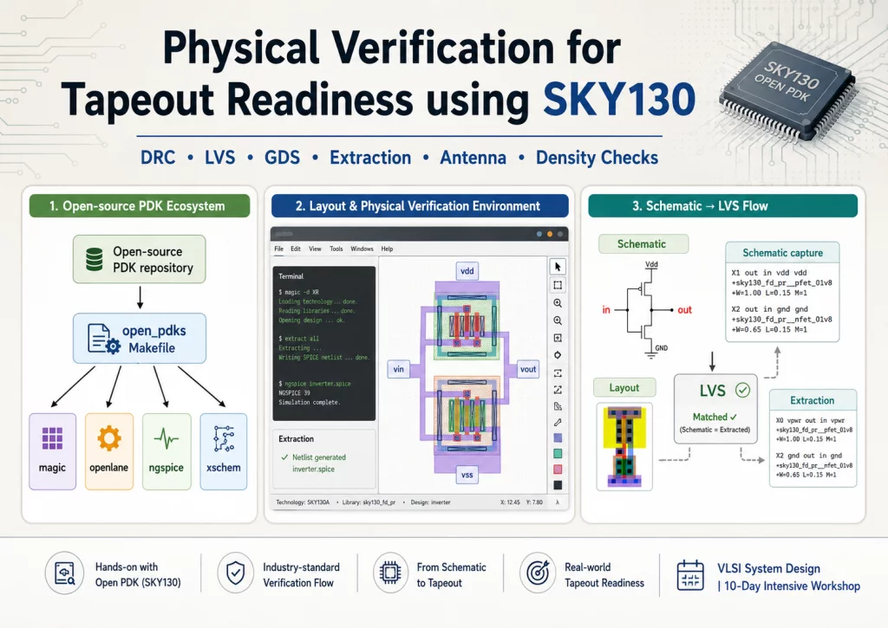
</p>

<p align="center">
Hands-on documentation of physical verification using the SKY130 Open PDK, covering DRC, LVS, layout extraction, verification debugging, and an overview of the OpenLANE RTL-to-GDSII flow.
</p>

---

## Repository Overview

This repository documents my hands-on learning from the **Physical Verification for Tapeout Readiness using SKY130** workshop conducted by **VLSI System Design (VSD)**.

It covers the practical physical verification flow using the **SKY130 Open PDK**, including **DRC, LVS, layout extraction, GDS handling, verification debugging**, and an overview of the **OpenLANE RTL-to-GDSII** flow through hands-on laboratory exercises.

The repository serves as a structured reference for understanding tapeout-ready physical verification using industry-relevant open-source EDA tools.

---
## Course Contributors

This workshop was conducted by **VLSI System Design (VSD)**. Special thanks to the following contributors for sharing their expertise and supporting the open-source VLSI community.

- **Kunal Ghosh** – [LinkedIn](https://www.linkedin.com/in/kunal-ghosh-vlsisystemdesign-com-28084836/)
- **R. Timothy Edwards** – [GitHub](https://github.com/RTimothyEdwards)
## Tools & Technologies

The following open-source tools and technologies were used throughout this workshop.

| Category | Tools |
|:---------|:------|
| **Process Design Kit (PDK)** | SKY130 Open PDK |
| **Design & Verification** | Magic, Xschem, Netgen, KLayout |
| **Simulation** | ngspice |
| **RTL-to-GDSII Flow** | OpenLANE, OpenROAD |
## Repository Navigation

| Module | Topics Covered |
|:-------|:---------------|
| **[Module 01 – Environment Setup & Physical Verification Flow](#module-01--environment-setup--physical-verification-flow)** | Tool setup, SKY130 PDK and physical verification workflow |
| **[Module 02 – DRC & LVS Fundamentals](#module-02--drc--lvs-fundamentals)** | Design Rule Check (DRC) and Layout Versus Schematic (LVS) fundamentals |
| **[Module 03 – DRC Rule Analysis & Debugging](#module-03--drc-rule-analysis--debugging)** | DRC rule analysis, violations and debugging |
| **[Module 04 – Layout Versus Schematic (LVS)](#module-04--layout-versus-schematic-lvs)** | Layout extraction, LVS execution and debugging |
| **[OpenLANE RTL-to-GDSII Flow Overview](#openlane-rtl-to-gdsii-flow-overview)** | RTL-to-GDSII physical design flow overview |
---

## Module 01 – Environment Setup & Physical Verification Flow

This module covers the installation of the open-source EDA tools required for physical verification using the **SKY130 Open PDK**. These tools are used throughout the workshop for layout design, circuit simulation, layout extraction, DRC, and LVS verification.

---
<p align="center">
    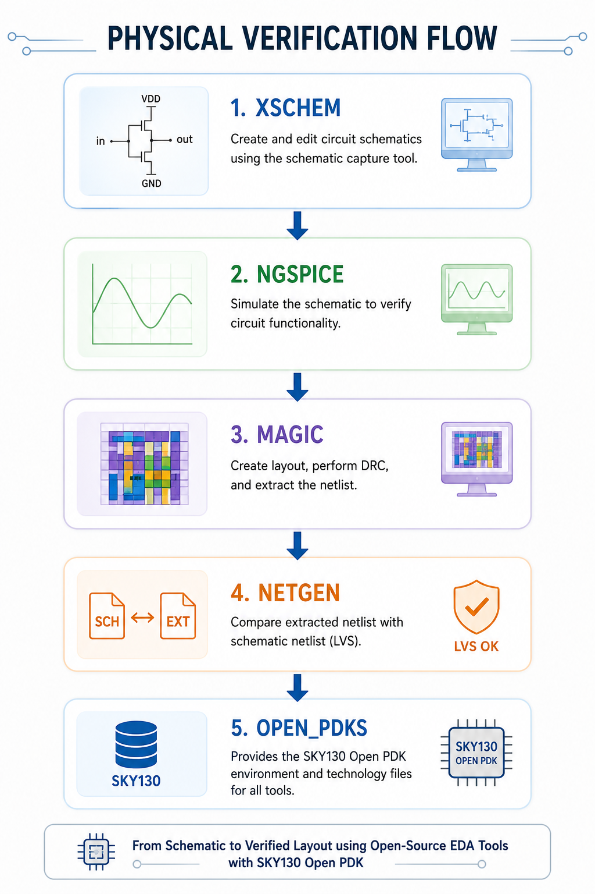
</p>

<p align="center">
    <em>Figure 1. Physical verification workflow using the SKY130 Open PDK and open-source EDA tools.</em>
</p>

### Magic

**Magic** is an open-source VLSI layout editor used for layout design, extraction, and Design Rule Checking (DRC).

**Installation**

```bash
git clone git://opencircuitdesign.com/magic
cd magic
./configure
make
sudo make install
```

**Reference:** [Magic Documentation](http://opencircuitdesign.com/magic/index.html)

---

### Netgen

**Netgen** is an open-source Layout Versus Schematic (LVS) tool used to compare schematic and extracted layout netlists.

**Installation**

```bash
git clone git://opencircuitdesign.com/netgen
cd netgen
./configure
make
sudo make install
```

**Reference:** [Netgen Documentation](http://opencircuitdesign.com/netgen/index.html)

---

### Xschem

**Xschem** is an open-source schematic capture tool used to create transistor-level circuit schematics.

**Installation**

```bash
git clone https://github.com/StefanSchippers/xschem.git xschem_git
cd xschem_git
./configure
make
sudo make install
```

**Reference:** [Xschem Documentation](http://repo.hu/projects/xschem/index.html)

---

### ngspice

**ngspice** is an open-source SPICE simulator used for analog and mixed-signal circuit simulation.

**Installation**

```bash
tar -zxvf ngspice-37.tar.gz
cd ngspice-37
mkdir release
cd release
../configure --with-x --with-readline=yes --disable-debug
make
sudo make install
```

To display simulation waveforms:

```bash
sudo apt-get update
sudo apt-get install xterm
```

**Reference:** [ngspice Documentation](https://ngspice.sourceforge.io/index.html)

---

### Open_PDKs

**Open_PDKs** configures the complete **SKY130 Open PDK** environment required by tools such as Magic, Netgen, KLayout, and OpenLANE.

**Installation**

```bash
git clone git://opencircuitdesign.com/open_pdks
cd open_pdks
./configure --enable-sky130-pdk
make
sudo make install
```

**Reference:** [Open_PDKs GitHub Repository](https://github.com/RTimothyEdwards/open_pdks)

---

### Common Installation Commands

The following commands are frequently used while building open-source EDA tools from source.

| Command | Description |
|:--------|:------------|
| `git clone` | Downloads the project source code from its repository. |
| `cd <directory>` | Navigates to the project directory. |
| `./configure` | Configures the build environment and checks required dependencies. |
| `make` | Compiles the source code into executable binaries. |
| `sudo make install` | Installs the compiled application on the system. |
| `tar -zxvf` | Extracts compressed source packages. |
| `mkdir` | Creates a new directory (commonly used for out-of-source builds). |

---

With the required tools successfully installed, the physical verification environment is ready. The next step is to understand the complete physical verification design flow before moving on to DRC and LVS verification.

<p align="right">
    <a href="#repository-navigation">Back to Navigation ↑</a>
</p>

### SKY130 PDK Integration

Before starting the laboratory exercises, verify that the **SKY130 Open PDK** is installed correctly and configure the required technology files for **Xschem**, **Magic**, and **Netgen**.

#### 1. Verify SKY130 PDK Installation

Use the following commands to confirm that the SKY130 PDK is available on your system.

```bash
ls /usr/share/pdk
ls /usr/share/pdk/sky130A
```

**Purpose:** Verifies that the SKY130 Open PDK is installed and accessible before configuring the design environment.

---

#### 2. Create the Project Workspace

Create a working directory and organize separate folders for each tool.

```bash
mkdir inverter
cd inverter

mkdir mag
mkdir netgen
mkdir xschem
```

**Purpose:** Creates a structured workspace for Magic, Netgen, and Xschem configuration files.

---

#### 3. Configure the SKY130 PDK

Link the required SKY130 technology files to each tool using symbolic links.

```bash
cd xschem

ln -s /usr/share/pdk/sky130A/libs.tech/xschem/xschemrc
ln -s /usr/share/pdk/sky130A/libs.tech/ngspice/spinit .spiceinit

cd ../mag

ln -s /usr/share/pdk/sky130A/libs.tech/magic/sky130A.magicrc .magicrc

cd ../netgen

ln -s /usr/share/pdk/sky130A/libs.tech/netgen/sky130A_setup.tcl setup.tcl
```

**Purpose:** Links the required SKY130 configuration files, enabling the EDA tools to use the correct technology libraries during layout, simulation, and LVS.

---

> **Note**
>
> The SKY130 PDK installation path may vary depending on your environment.
>
> - **VSD Cloud Workspace (used in this workshop):**
>   ```
>   /usr/share/pdk/sky130A/
>   ```
>
> - **Some Linux installations:**
>   ```
>   /usr/local/share/pdk/sky130A/
>   ```
>
> Verify the installation path before creating the symbolic links.
<p align="right">
    <a href="#repository-navigation">Back to Navigation ↑</a>
</p>
#### Integration Verification

The following screenshots confirm that each tool is successfully configured and linked with the **SKY130 Open PDK** environment.

<table align="center">
<tr>
<td align="center">
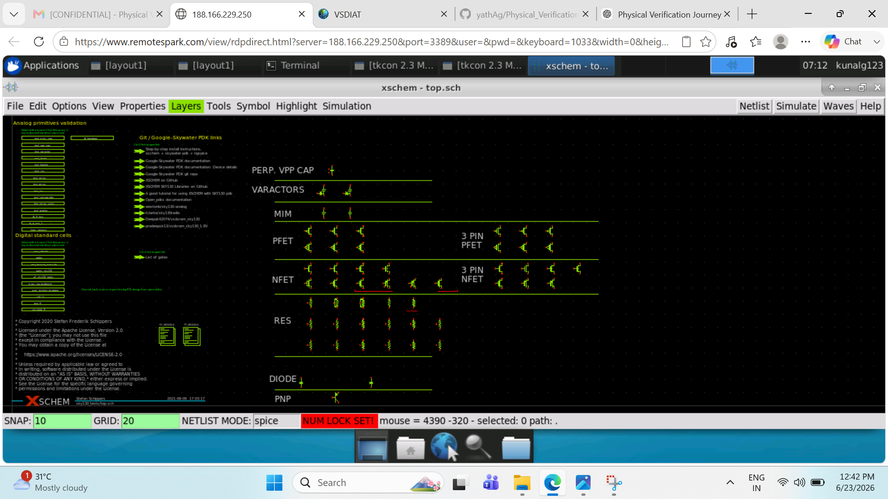<br>
<em>Figure 2. Xschem successfully configured with SKY130 PDK.</em>
</td>

<td align="center">
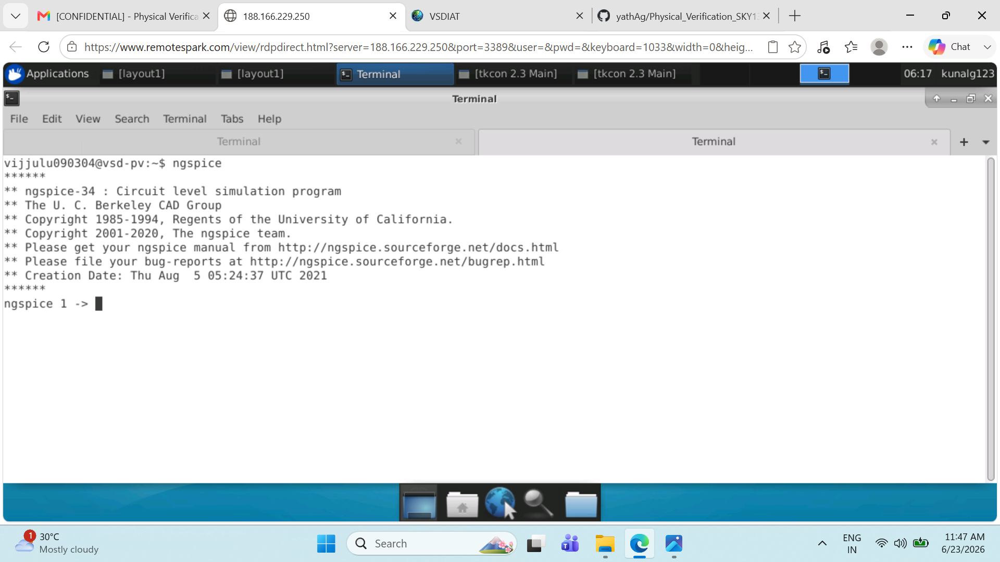<br>
<em>Figure 3. ngspice successfully configured with SKY130 PDK.</em>
</td>
</tr>

<tr>
<td align="center">
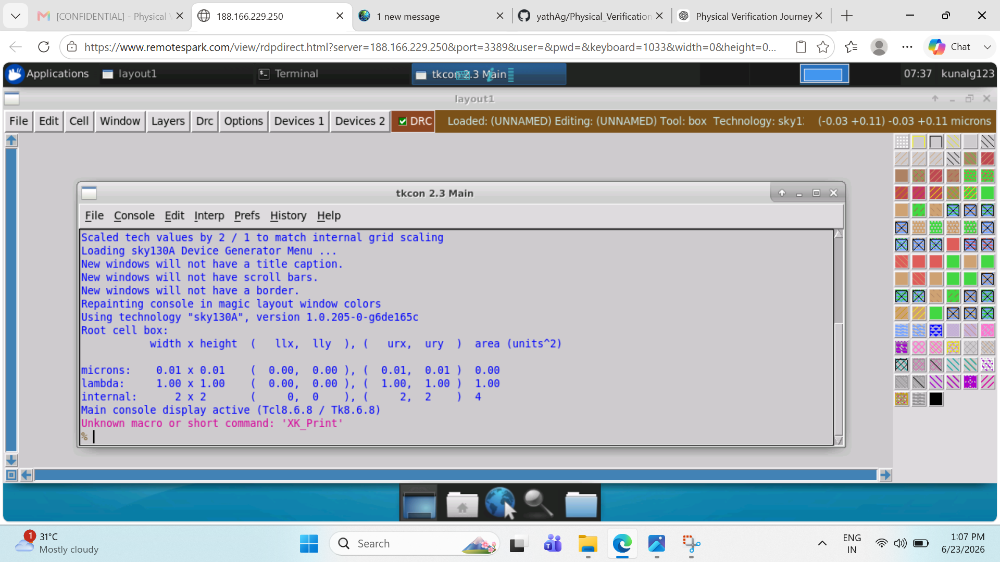<br>
<em>Figure 4. Magic successfully loaded with the SKY130 technology file.</em>
</td>

<td align="center">
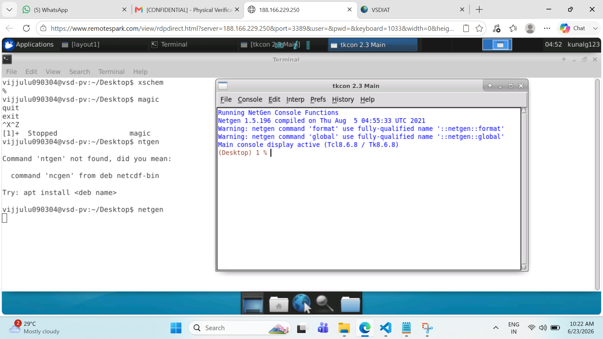<br>
<em>Figure 5. Netgen successfully configured for LVS using SKY130.</em>
</td>
</tr>
</table>
---

## CMOS Inverter Design & Verification Workflow

This example demonstrates the complete physical verification workflow using a CMOS inverter. Starting from schematic design, the circuit is simulated, implemented as a physical layout, extracted into a SPICE netlist, and finally verified using LVS with Netgen.

---

### Step 1 – CMOS Inverter Schematic

The CMOS inverter schematic is created in **Xschem** using the SKY130 device library. After placing the PMOS and NMOS devices, the required device parameters are configured before generating the circuit symbol for simulation.

<p align="center">
    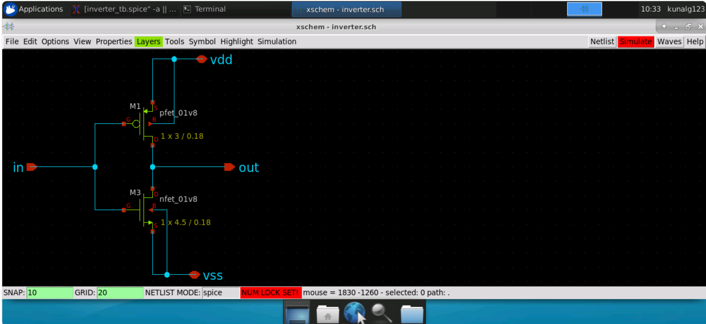
</p>

<p align="center">
    <em>Figure 6. CMOS inverter schematic created in Xschem using the SKY130 device library.</em>
</p>

---

### Step 2 – Circuit Simulation

A dedicated testbench is created using the generated inverter symbol to verify the circuit operation in **ngspice**. The voltage transfer characteristics (VTC) confirm the expected switching behaviour of the CMOS inverter.

<p align="center">
    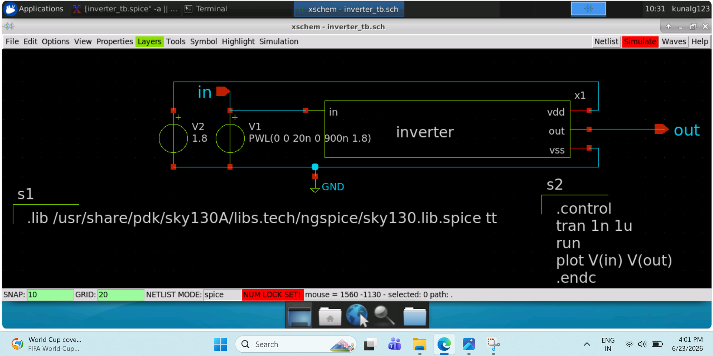
</p>

<p align="center">
    <em>Figure 7. Testbench schematic used for CMOS inverter simulation.</em>
</p>

<p align="center">
    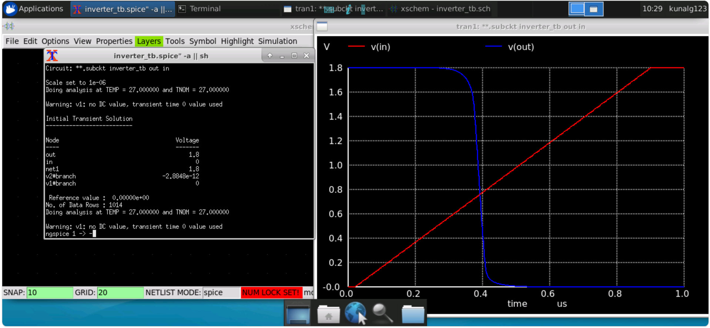
</p>

<p align="center">
    <em>Figure 8. ngspice simulation showing the generated VTC characteristics.</em>
</p>

<p align="center">
    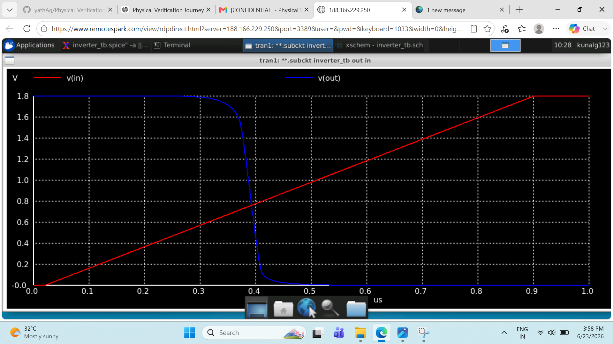
</p>

<p align="center">
    <em>Figure 9. CMOS inverter Voltage Transfer Characteristic (VTC).</em>
</p>

> **Observation:** The simulation confirms the expected inverter switching behaviour before proceeding to physical layout implementation.

---

### Step 3 – Physical Layout Implementation

The verified schematic is implemented as a physical layout in **Magic** using the SKY130 technology. Device placement and routing are completed before extracting the layout netlist.

<p align="center">
    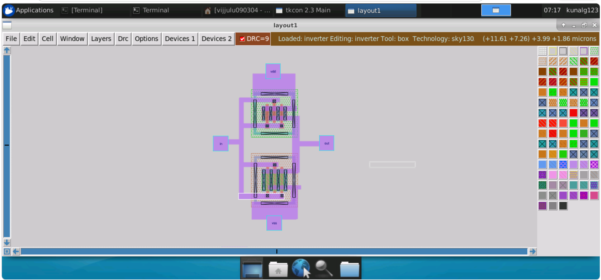
</p>

<p align="center">
    <em>Figure 10. CMOS inverter layout implemented using Magic.</em>
</p>

---

### Step 4 – Layout Extraction

After completing the layout, the extracted SPICE netlist is generated using the following Magic commands.

```tcl
extract do local
extract all
ext2spice lvs
ext2spice
```

| Command | Purpose |
|:--------|:--------|
| `extract do local` | Enables local layout extraction. |
| `extract all` | Extracts the complete layout. |
| `ext2spice lvs` | Generates an LVS-compatible SPICE netlist. |
| `ext2spice` | Generates the extracted SPICE netlist from the layout. |

<p align="center">
    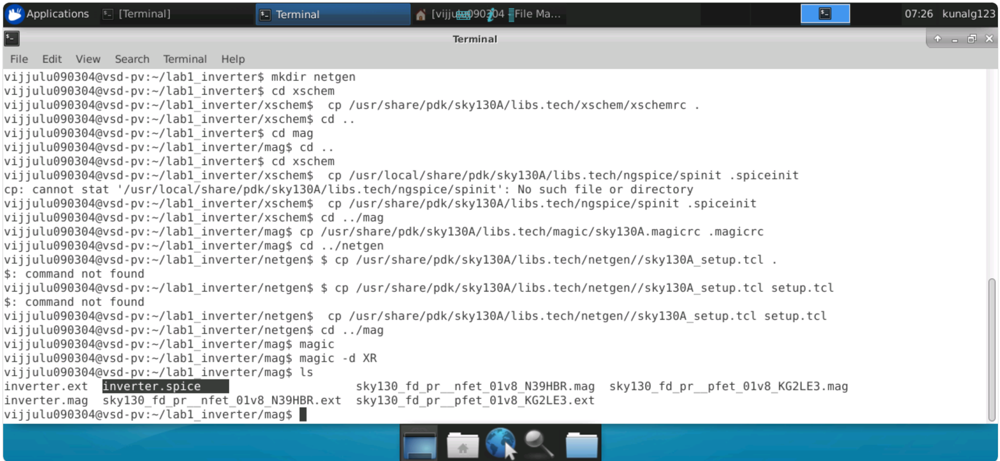
</p>

<p align="center">
    <em>Figure 11. Layout extraction completed successfully.</em>
</p>

<p align="center">
    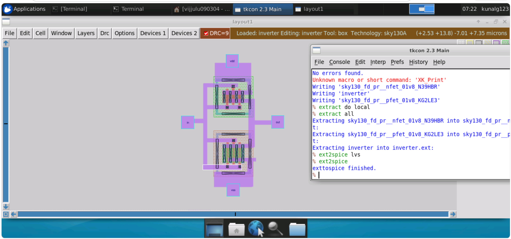
</p>

<p align="center">
    <em>Figure 12. Extracted SPICE netlist generated from the Magic layout.</em>
</p>

---

### Step 5 – Layout Versus Schematic (LVS)

The extracted layout netlist is compared with the original schematic netlist using **Netgen**.

```bash
netgen -batch lvs "../mag/inverter.spice inverter" "../xschem/inverter.spice inverter"
```

**Purpose:** Performs Layout Versus Schematic (LVS) verification by comparing the extracted layout netlist with the schematic netlist.

<p align="center">
    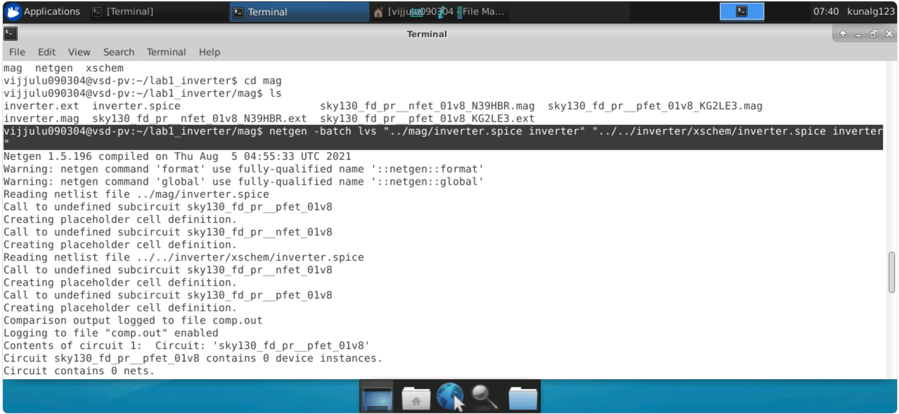
</p>

<p align="center">
    <em>Figure 13. Executing LVS verification using Netgen.</em>
</p>

<p align="center">
    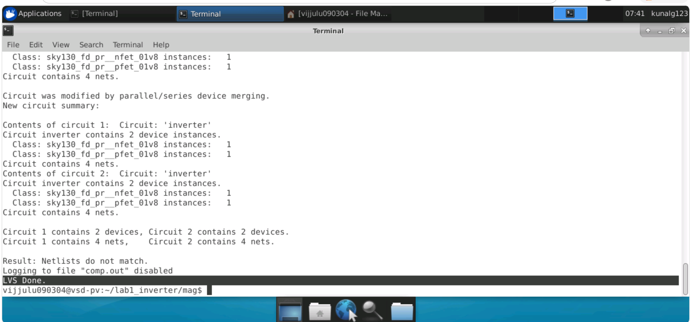
</p>

<p align="center">
    <em>Figure 14. LVS comparison result generated by Netgen.</em>
</p>

> **Observation:** The LVS comparison reports mismatches between the schematic and layout netlists. This example is included to demonstrate the complete verification workflow and LVS execution process rather than achieving a fully matched LVS result.

<p align="right">
    <a href="#repository-navigation">Back to Navigation ↑</a>
</p>
---

## Module 02 – DRC & LVS Fundamentals

This module introduces the fundamental concepts of **Design Rule Checking (DRC)** and **Layout Versus Schematic (LVS)** using the **SKY130 Open PDK**. It demonstrates how layouts are imported, extracted, verified against foundry design rules, and compared with the original schematic to ensure design correctness.

### DRC & LVS Verification Flow

<p align="center">
    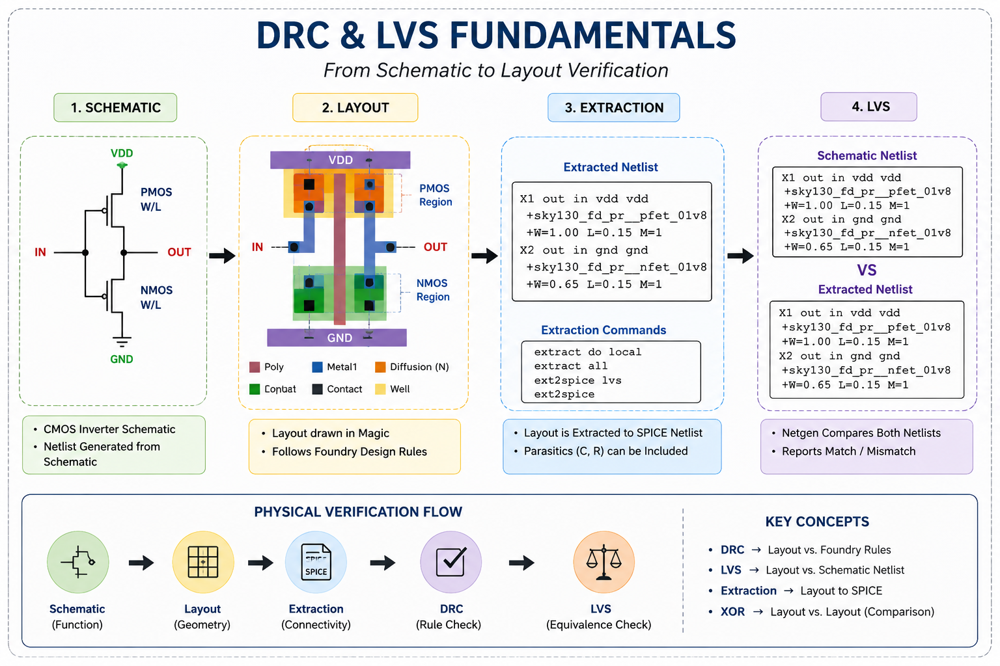
</p>

<p align="center">
    <em>Figure 15. Overview of the physical verification flow from schematic design to layout verification using DRC and LVS.</em>
</p>

---
### Reading Standard Cell Layouts

Before loading the standard-cell GDS, copy the **SKY130 Magic technology file** into the working directory to ensure the layout is opened with the correct SKY130 process configuration.

#### Commands Used

```tcl
cp /usr/share/pdk/sky130A/libs.tech/magic/sky130A.magicrc ./.magicrc

gds read /usr/share/pdk/sky130A/libs.ref/sky130_fd_sc_hd/gds/sky130_fd_sc_hd.gds

load sky130_fd_sc_hd__and2_1
```

<p align="center">
    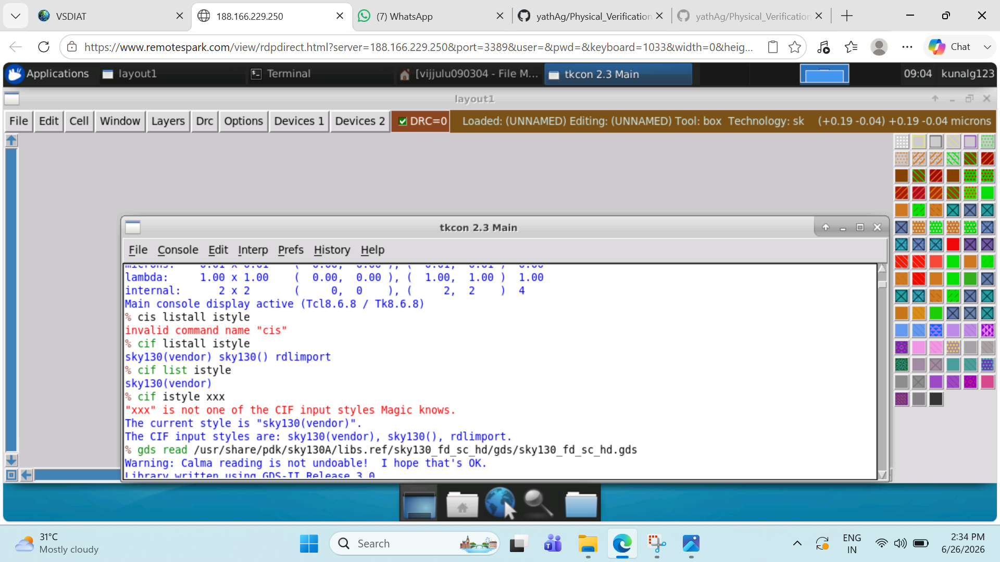
</p>

<p align="center">
    <em>Figure 16. Copying the SKY130 Magic technology file and importing the standard-cell GDS library.</em>
</p>

<p align="center">
    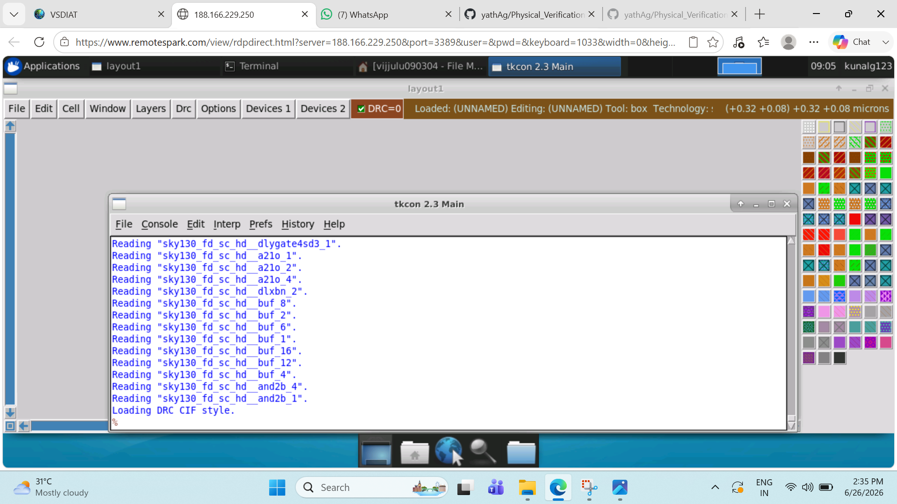
</p>

<p align="center">
    <em>Figure 17. Reading the SKY130 standard-cell GDS database into Magic.</em>
</p>

<p align="center">
    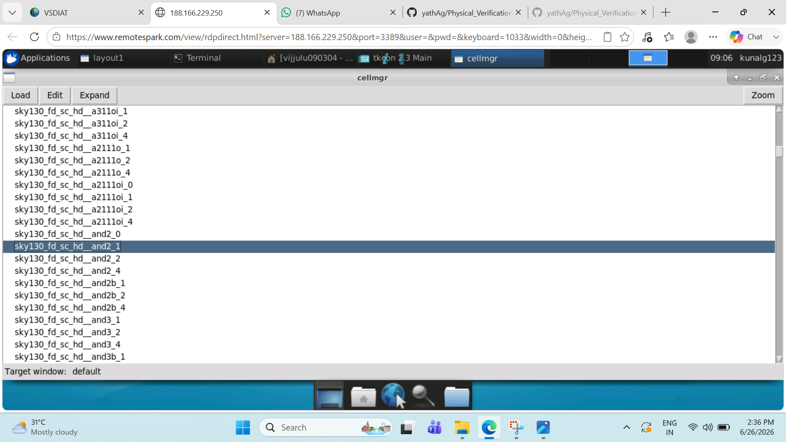
</p>

<p align="center">
    <em>Figure 18. Selecting and loading the <code>sky130_fd_sc_hd__and2_1</code> standard cell.</em>
</p>

<p align="center">
    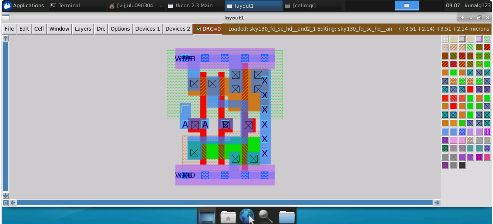
</p>

<p align="center">
    <em>Figure 19. Layout view of the <code>sky130_fd_sc_hd__and2_1</code> standard cell in Magic.</em>
</p>

> **Observation:** The SKY130 AND2 standard cell is successfully imported and loaded into Magic, making it ready for further physical verification operations such as metadata configuration, extraction, DRC, and LVS.
> ---

### Configuring Ports & Layout Metadata

To enable accurate physical verification, the standard cell layout is configured with the required **port information** and **metadata**. This ensures proper mapping between the layout and the corresponding SPICE netlist during LVS verification.

#### Commands Used

```tcl
port first
port 1 name
port 1 class
port 1 use

lef read /usr/share/pdk/sky130A/libs.ref/sky130_fd_sc_hd/lef/sky130_fd_sc_hd.lef

readspice /usr/share/pdk/sky130A/libs.ref/sky130_fd_sc_hd/spice/sky130_fd_sc_hd.spice

load sky130_fd_sc_hd__and2_1
```
<p align="center">
    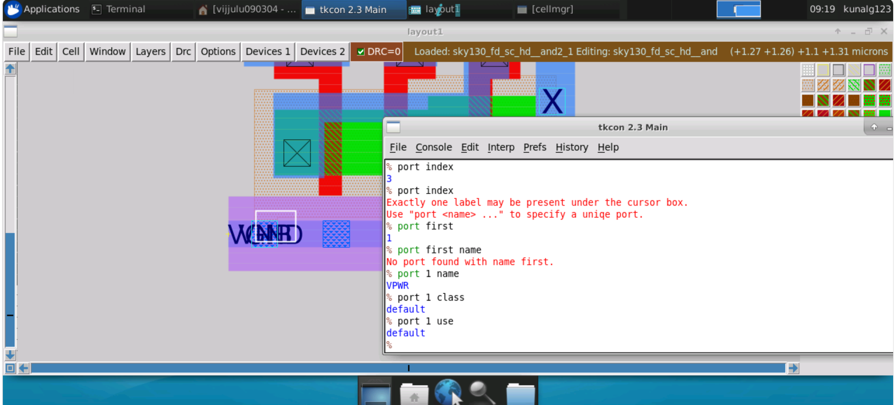
</p>

<p align="center">
    <em>Figure 20. Configuring port information for the standard cell.</em>
</p>

<p align="center">
    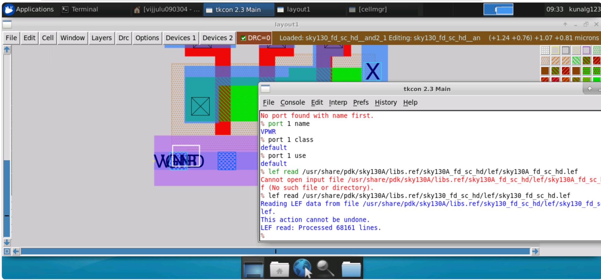
</p>

<p align="center">
    <em>Figure 21. Importing LEF data for the SKY130 standard-cell library.</em>
</p>
<p align="center">
    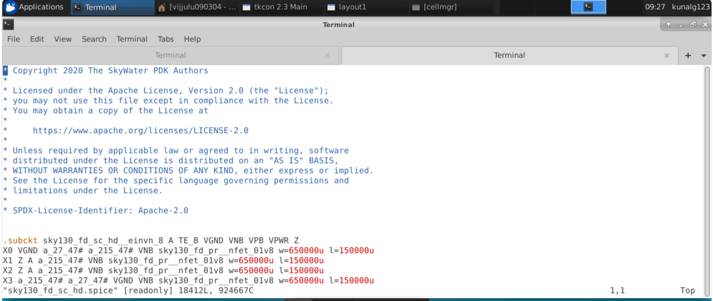
</p>

<p align="center">
    <em>Figure 22. SPICE library loaded successfully, providing the netlist information required for LVS verification.</em>
</p>
---

### Working with Standard Cell Instances

Magic supports hierarchical layout design by allowing existing standard cells to be loaded, instantiated, and edited. This section demonstrates the difference between **`load`** and **`getcell`**, along with the process of making an imported cell writable for modification.

#### Commands Used

```tcl
lef read /usr/share/pdk/sky130A/libs.ref/sky130_fd_sc_hd/lef/sky130_fd_sc_hd.lef

load sky130_fd_sc_hd__and2_1

readspice /usr/share/pdk/sky130A/libs.ref/sky130_fd_sc_hd/spice/sky130_fd_sc_hd.spice

load test

getcell sky130_fd_sc_hd__and2_1

gds write test

property

cellname writeable sky130_fd_sc_hd__and2_1 true

gds write test
```

> **Note**
>
> - **`load`** opens an existing layout cell for viewing or editing.
> - **`getcell`** places an instance of an existing cell inside the current layout, enabling hierarchical design.

<p align="center">
    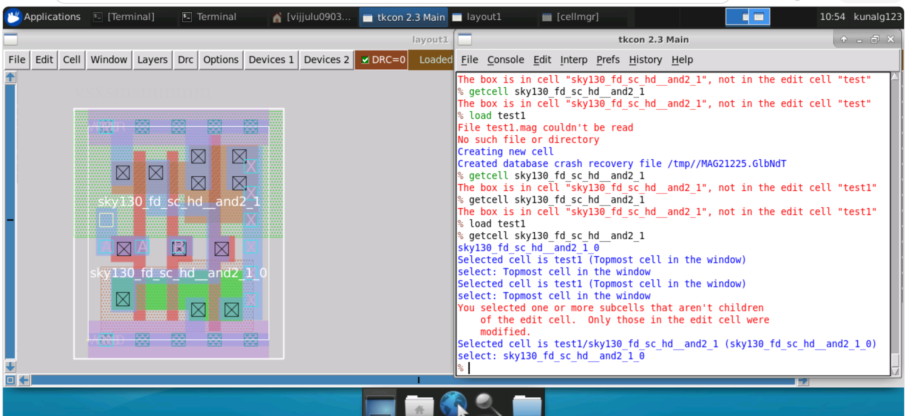
</p>

<p align="center">
    <em>Figure 23. Placing the <code>sky130_fd_sc_hd__and2_1</code> standard cell as an instance using <code>getcell</code>.</em>
</p>

<p align="center">
    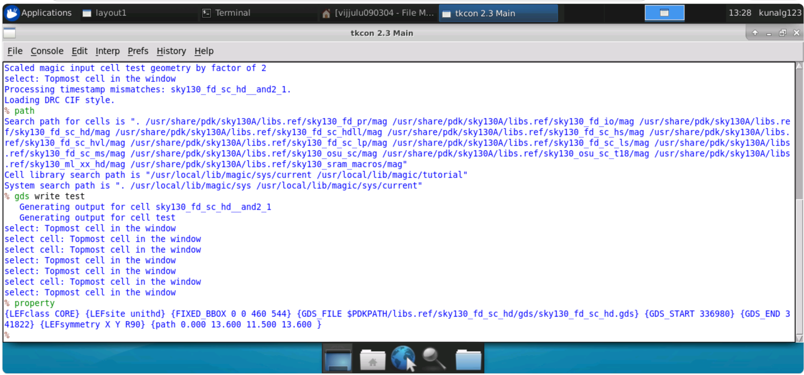
</p>

<p align="center">
    <em>Figure 24. Making the imported standard cell writable before exporting the updated layout.</em>
</p>

> **Observation:** The standard cell is successfully instantiated and marked as writable, allowing hierarchical layouts to be modified and saved for further physical verification.
> ---

### Layout Extraction

Once the layout is completed, **Magic** extracts the electrical connectivity and generates a SPICE netlist from the physical layout. The extracted netlist serves as the input for subsequent LVS verification.

#### Commands Used

```tcl
extract all

ext2spice lvs

ext2spice
```

<p align="center">
    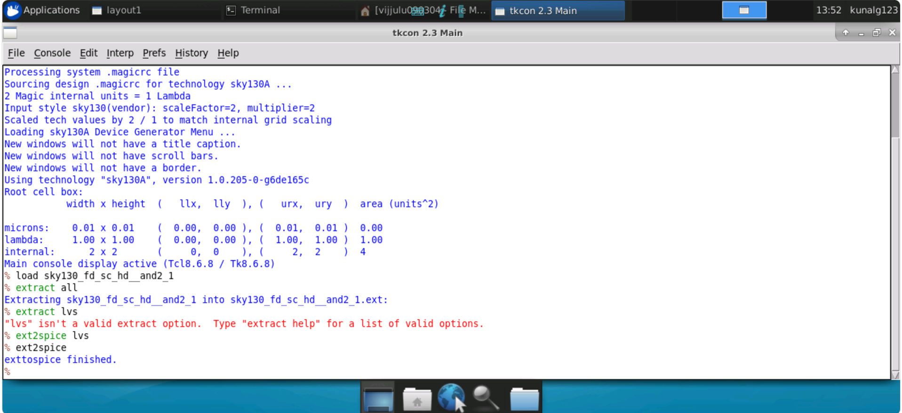
</p>

<p align="center">
    <em>Figure 25. Extracting the layout and generating an LVS-compatible SPICE netlist.</em>
</p>

<p align="center">
    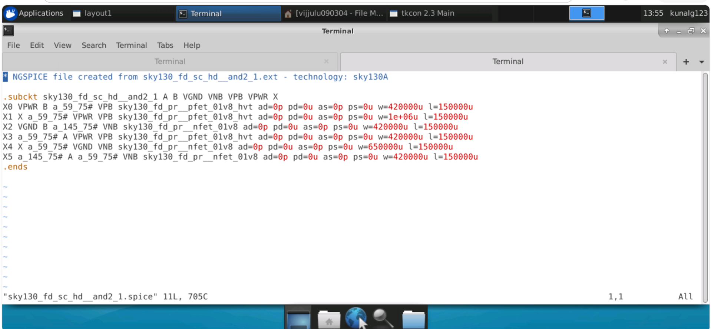
</p>

<p align="center">
    <em>Figure 26. SPICE netlist generated from the extracted layout.</em>
</p>

> **Observation:** The layout is successfully extracted into a SPICE netlist, providing the electrical representation required for LVS verification.
> #### Advanced Extraction Options

Magic also provides additional extraction commands for generating simulation files and including parasitic resistance and capacitance information.

##### Commands Used

```tcl
ext2spice cthresh 0.01
ext2spice

ext2sim labels on
ext2sim

extresist tolerance 10
extresist

ext2spice lvs
ext2spice cthresh 0.01
ext2spice extresist on
ext2spice
```
<p align="center">
    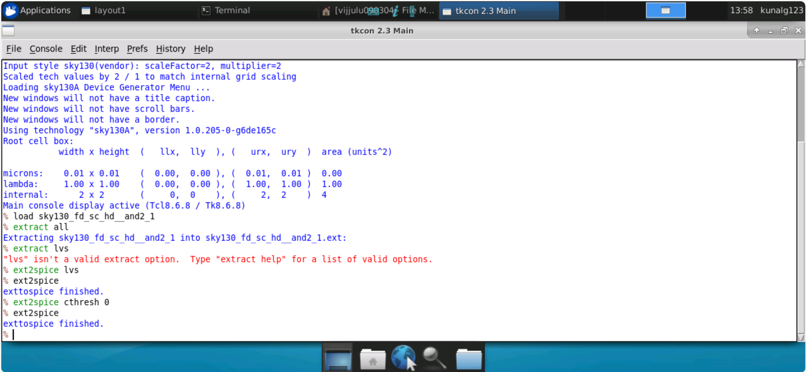
</p>

<p align="center">
    <em>Figure 27. Generating the extracted SPICE netlist with capacitance information.</em>
</p>
<p align="center">
    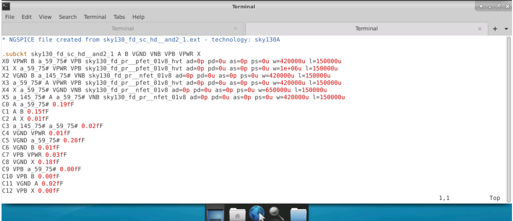
</p>

<p align="center">
    <em>Figure 28. SPICE netlist generated from the extracted layout.</em>
</p>
<p align="center">
    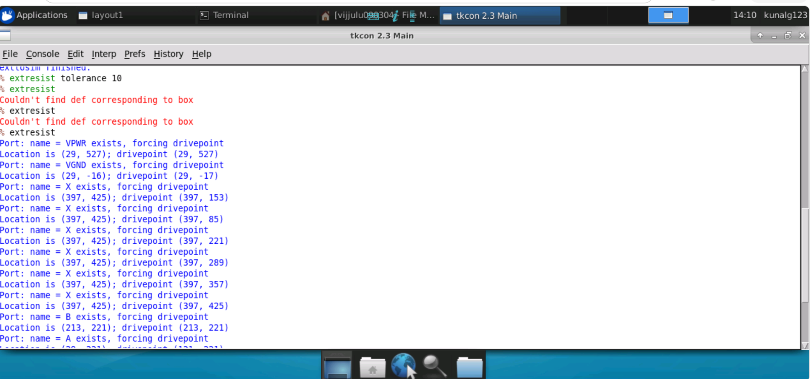
</p>

<p align="center">
    <em>Figure 29. Generating the extracted SPICE netlist with resistance information.</em>
</p>
</p>
<p align="center">
    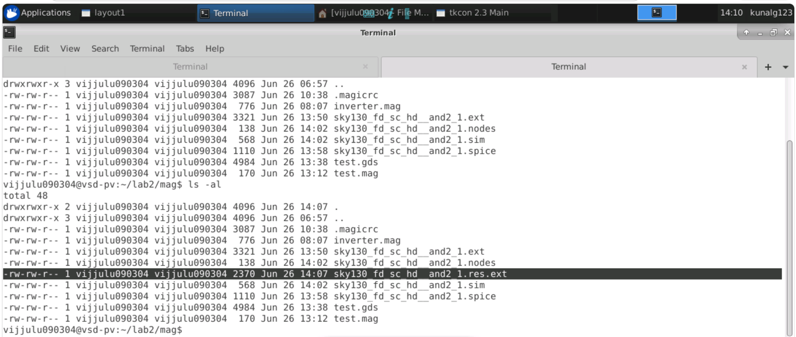
</p>
<p align="center">
    <em>Figure 30.files created after all extraction operations</em>
</p>

---

### Design Rule Check (DRC)

Design Rule Check (DRC) verifies that the layout complies with the manufacturing rules defined by the **SKY130 Open PDK**. It identifies spacing, width, enclosure, and connectivity violations that could affect fabrication.

#### Commands Used

```bash
/usr/share/pdk/sky130A/libs.tech/magic/run_standard_drc.py \
/usr/share/pdk \
sky130A/libs.ref/sky130_fd_sc_hd/mag/sky130_fd_sc_hd__and2_1.mag
```

```tcl
drc listall why

drc style drc(full)

drc check

drc why

drc find

getcell sky130_fd_sc_hd__tapvpwrvgnd_1
```

<p align="center">
    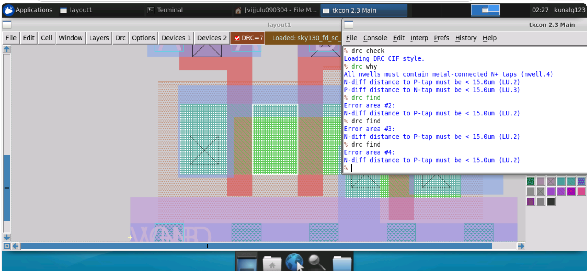
</p>

<p align="center">
    <em>Figure 31. Running Design Rule Check (DRC) on the SKY130 standard cell.</em>
</p>

<p align="center">
    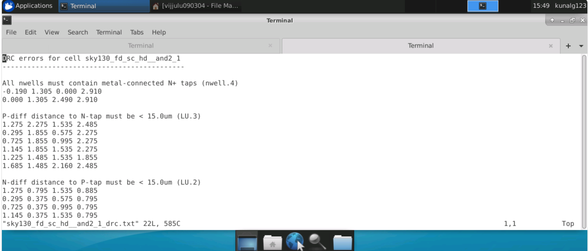
</p>

<p align="center">
    <em>Figure 32. Viewing DRC results and locating rule violations in Magic.</em>
</p>

> **Observation:** The DRC engine successfully checks the layout against the SKY130 design rules and reports any rule violations that require correction before fabrication.
> After confirming that the layout satisfies the required design rules, the next step is to verify its electrical equivalence with the schematic using **Layout Versus Schematic (LVS)**.
> ---

### Layout Versus Schematic (LVS)

After the layout successfully passes DRC, the next step is to verify its electrical equivalence with the original schematic. **Netgen** compares the extracted layout netlist against the reference SPICE netlist and reports whether both designs match.

#### Commands Used

```bash
netgen -batch lvs \
"../mag/sky130_fd_sc_hd__and2_1.spice sky130_fd_sc_hd__and2_1" \
"/usr/share/pdk/sky130A/libs.ref/sky130_fd_sc_hd/spice/sky130_fd_sc_hd.spice sky130_fd_sc_hd__and2_1"
```

<p align="center">
    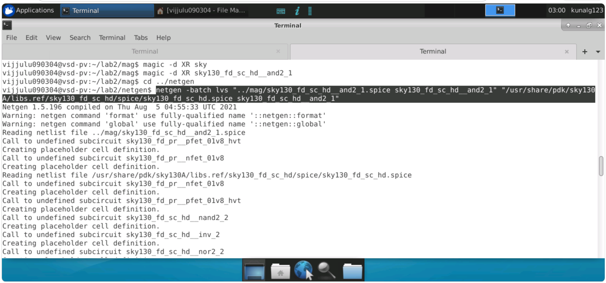
</p>

<p align="center">
    <em>Figure 33. Executing Layout Versus Schematic (LVS) verification using Netgen.</em>
</p>

<p align="center">
    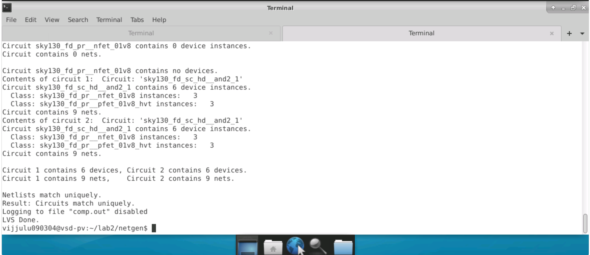
</p>

<p align="center">
    <em>Figure 34. LVS comparison between the extracted layout netlist and the reference SPICE netlist.</em>
</p>

> **Observation:** Netgen successfully compares the extracted layout with the reference schematic netlist and reports the LVS verification result.

After confirming the electrical equivalence between the layout and schematic, the final verification step is to compare layouts using **XOR verification**.
---

### XOR Verification

XOR verification compares two layout databases and highlights any geometric differences between them. This technique is commonly used to validate layout modifications and identify unintended changes.

#### Commands Used

```tcl
flatten -nolabels xor_test

xor -nolabels xor_test

load xor_test
```

<p align="center">
    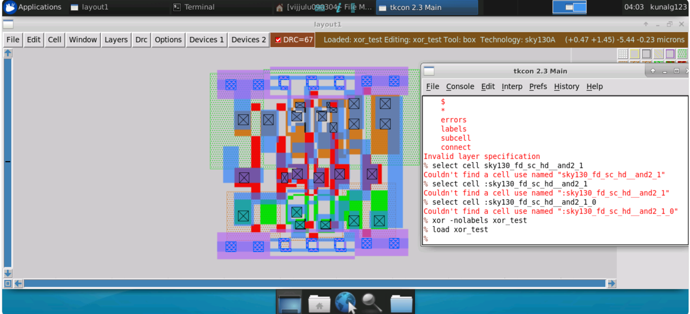
</p>

<p align="center">
    <em>Figure 35. Performing XOR verification to compare layout differences.</em>
</p>

> **Observation:** XOR verification highlights any geometric differences between the reference and modified layouts, helping identify unintended layout changes.


## Module 02 – Physical Verification Command Reference

| Command | Purpose |
|:--------|:--------|
| `gds read` | Imports a GDS layout into Magic. |
| `load` | Opens an existing layout cell for viewing or editing. |
| `getcell` | Places an instance of a cell into the current layout. |
| `lef read` | Imports LEF information for standard cells. |
| `readspice` | Loads the reference SPICE netlist into Magic. |
| `extract all` | Extracts the complete layout geometry. |
| `ext2spice lvs` | Generates an LVS-compatible SPICE netlist. |
| `ext2spice` | Generates the extracted SPICE netlist. |
| `ext2spice cthresh 0.01` | Includes parasitic capacitance above the specified threshold. |
| `ext2sim labels on` | Preserves layout labels in the simulation netlist. |
| `ext2sim` | Generates a simulation netlist from the extracted layout. |
| `extresist tolerance 10` | Sets the tolerance for resistance extraction. |
| `extresist` | Extracts parasitic resistance from the layout. |
| `ext2spice extresist on` | Includes extracted resistance in the SPICE netlist. |
| `drc style drc(full)` | Enables the complete SKY130 DRC rule deck. |
| `drc check` | Runs Design Rule Check on the current layout. |
| `drc why` | Displays the reason for a DRC violation. |
| `drc find` | Navigates to the detected DRC violation. |
| `netgen -batch lvs` | Performs Layout Versus Schematic verification. |
| `flatten -nolabels` | Creates a flattened layout for comparison. |
| `xor -nolabels` | Compares two layouts and highlights geometric differences. |
<p align="right">
    <a href="#repository-navigation">Back to Navigation ↑</a>
</p>
---

---

# Module 03 – DRC Rule Analysis & Debugging

This module focuses on understanding, analyzing, and debugging **Design Rule Check (DRC)** violations using the **SKY130 Open PDK**. It introduces common layout rule violations, explains why they occur, and demonstrates practical techniques for identifying and fixing them using **Magic Layout** before achieving a DRC-clean design.

## DRC Rule Analysis & Debugging Flow

<p align="center">
    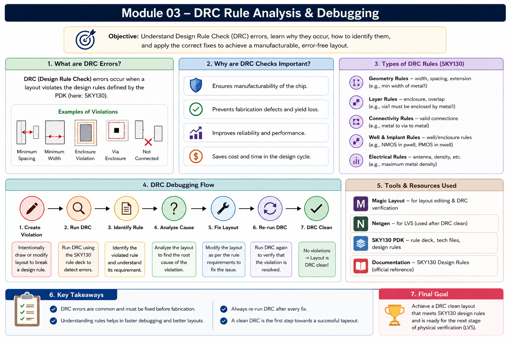
</p>

<p align="center">
    <em>Figure 36. Overview of the DRC rule analysis and debugging workflow followed throughout this module.</em>
</p>

---
### Reference and Resources

This module follows the design rules defined by the official **SKY130 Open PDK** documentation. The practical demonstrations cover only a subset of the complete rule deck used during physical verification.

- **Official SKY130 Design Rules:** https://skywater-pdk.readthedocs.io/en/main/rules.html
- **SKY130 PDK Documentation:** https://skywater-pdk.readthedocs.io/en/main/
## Magic Layout Shortcut Keys

| Shortcut | Function |
|:---------|:---------|
| **Left Click** | Change the layout box (cursor) position. |
| **Right Click** | Draw the selection box. |
| **Middle Click** | Paint the selected layer inside the box. |
| **G** | Toggle layout grid. |
| **U** | Undo the previous action. |
| **Shift + U** | Redo the last undone action. |
| **I** | Select the top-most cell. |
| **F** | Mirror the selected object. |
| **Z** | Zoom in. |
| **Shift + Z** | Zoom out. |
| **A** | Select everything inside the box. |
| **Shift + A** | Add to the current selection. |
| **C** | Copy the selected object. |
| **E** | Edit the selected cell. |
| **O** | Open the selected cell. |
| **4 / 8 / 6 / 2** | Move the selected object left, up, right, and down. |

## Frequently Used Magic Commands

| Command | Purpose |
|:--------|:--------|
| `drc find` | Locate the next DRC violation. |
| `label <name>` | Create a label for a layout terminal. |
| `extract all` | Extract the complete layout. |
| `ext2spice` | Generate the extracted SPICE netlist. |
| `getcell <file.mag>` | Insert an existing cell into the current layout. |
| `load <file.mag>` | Open a layout for editing. |
| `x` | Expand and view the contents of the selected cell. |
## VLSI Terminology

| Term | Description |
|:-----|:------------|
| **DRC** | Design Rule Check used to verify layout manufacturability. |
| **PDK** | Process Design Kit containing technology files, devices, and design rules. |
| **Tapeout** | Final GDSII layout submission for fabrication. |
| **Foundry** | Semiconductor fabrication facility where chips are manufactured. |
| **Technology Node** | Process feature size used during fabrication (e.g., SKY130). |
| **GDSII** | Standard file format used to exchange IC layout data. |
## Density Fill Generation

The following commands are used to generate and load metal fill patterns for density verification.

### Commands Used

```bash
/usr/share/pdk/sky130A/libs.tech/magic/check_density.py exercise_11.gds

/usr/share/pdk/sky130A/libs.tech/magic/generate_fill.py exercise_11.mag
```

```tcl
load exercise_11

box values 0 0 0 0

getcell exercise_11_fill_pattern child 0 0
```

> **Purpose:** Generates and loads metal fill patterns required to satisfy density rules before tapeout.
> > 📄 **Quick Reference:** [Magic Layout Shortcut Keys & Commands (PDF)](images/module_03/Magic_rules_and_short_keys.pdf)
> ---
>
> ---

## Practical 01 – Minimum Width Rule

### Objective

Understand how the minimum width rule is checked and why narrow geometries violate the SKY130 design rules.

#### Commands Used

```tcl
drc check

drc why

drc find
```
<table align="center">
<tr>
<td align="center" width="50%">

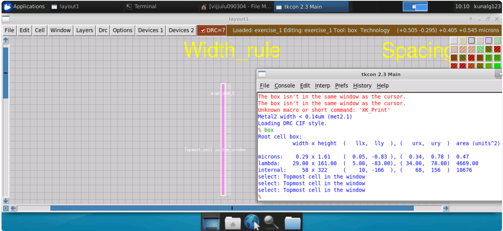

**Figure 37.** Minimum width rule violation (**Before Fix**).

</td>

<td align="center" width="50%">

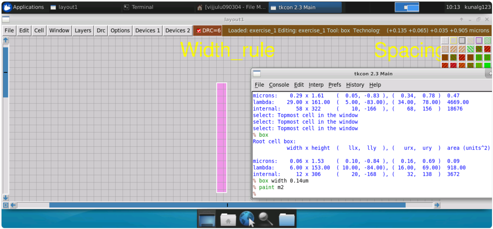

**Figure 38.** Minimum width rule after applying the required fix.

</td>
</tr>
</table>

<br>

<table align="center">
<tr>

<td align="center" width="50%">

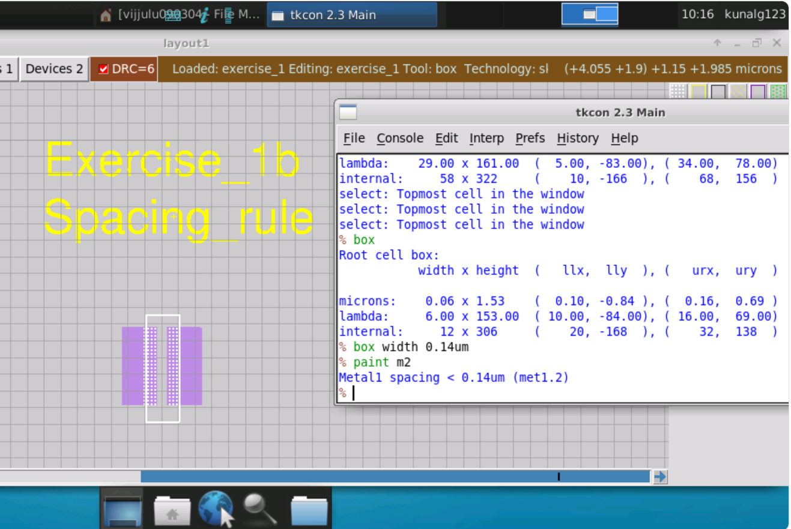

**Figure 39.** Minimum spacing rule violation (**Before Fix**).

</td>

<td align="center" width="50%">

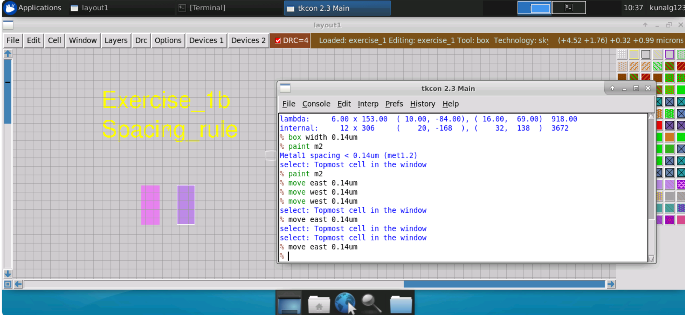

**Figure 40.** Minimum spacing rule after applying the required fix.

</td>

</tr>
</table>
<br>

<table align="center">
<tr>
<td align="center" width="50%">

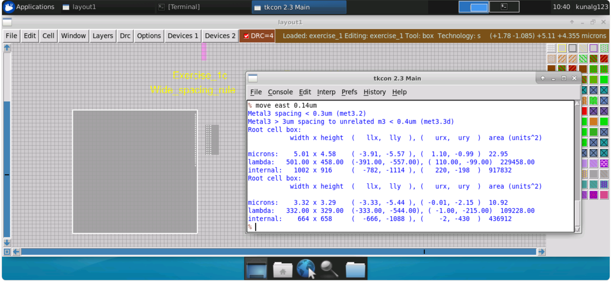

**Figure 41.** Wide spacing rule violation (**Before Fix**).

</td>

<td align="center" width="50%">

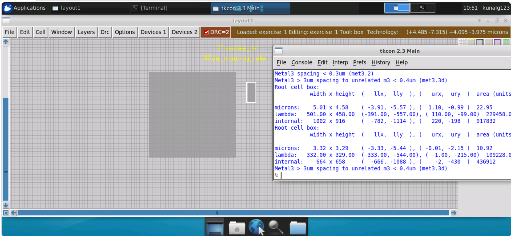

**Figure 42.** Wide spacing rule after applying the required fix.

</td>
</tr>
</table>

<br>

<table align="center">
<tr>
<td align="center" width="50%">

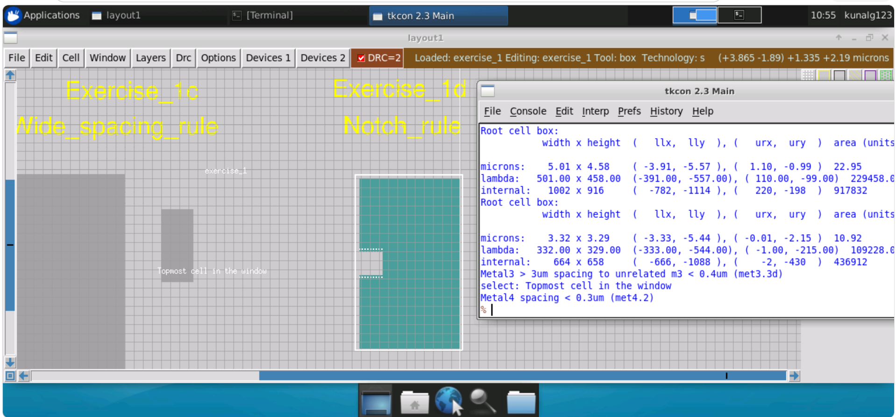

**Figure 43.** Notch rule violation (**Before Fix**).

</td>

<td align="center" width="50%">

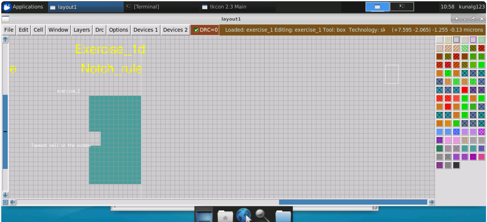

**Figure 44.** Notch rule after applying the required fix.

</td>
</tr>
</table>


## Practical 02 – Via Rules

### Objective

Understand the fundamental **via-related design rules** in the SKY130 PDK, including via dimensions, multiple via placement, overlap requirements, and automatic via generation. These checks ensure reliable electrical connectivity between adjacent metal layers.

#### Commands Used

```tcl
drc check
drc why
drc find
```

<table align="center">
<tr>

<td align="center" width="50%">

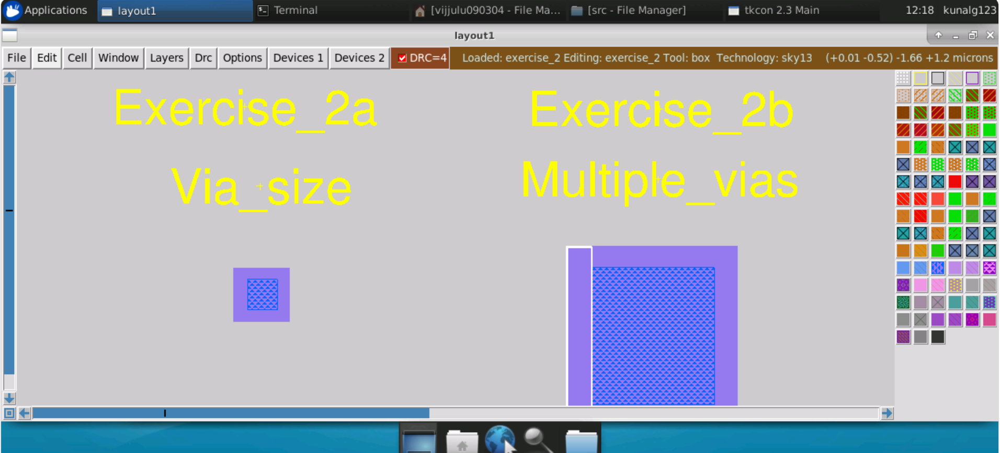

**Figure 45.** Via size rule verification.

</td>

<td align="center" width="50%">

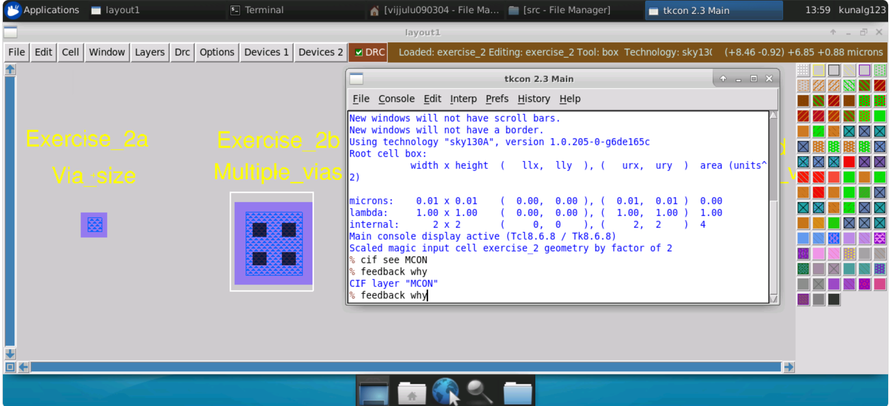

**Figure 46.** Multiple via placement verification.

</td>

</tr>
</table>

<br>

<table align="center">
<tr>

<td align="center" width="50%">

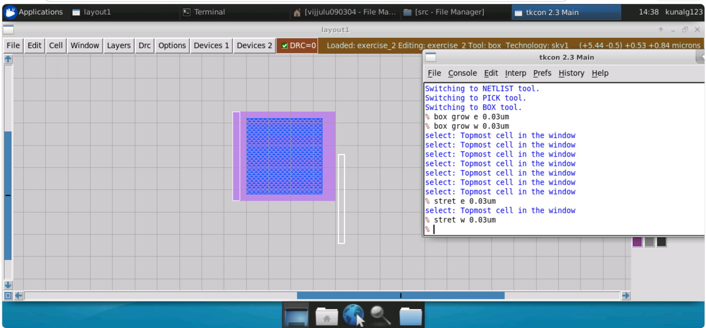

**Figure 47.** Via overlap rule verification.

</td>

<td align="center" width="50%">

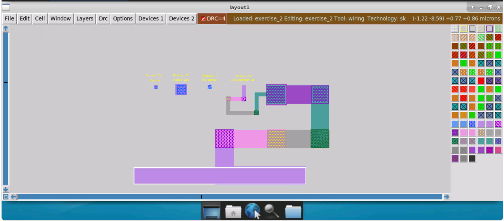

**Figure 48.** Automatic via generation using Magic.

</td>

</tr>
</table>

---

## Practical 03 – Area Rules

### Objective

Understand the **minimum area** and **minimum hole** rules defined in the SKY130 PDK. These rules ensure that layout geometries meet the minimum manufacturable area requirements and avoid creating enclosed openings that are too small for reliable fabrication.

#### Commands Used

```tcl
drc check
drc why
drc find
```

<table align="center">
<tr>

<td align="center" width="50%">

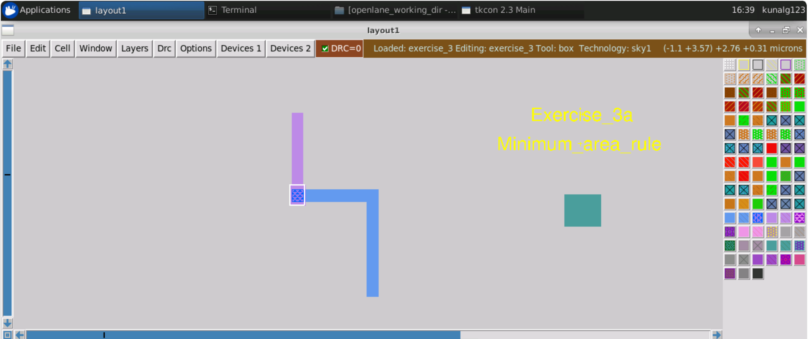

**Figure 49.** Minimum area rule verification.

</td>

<td align="center" width="50%">

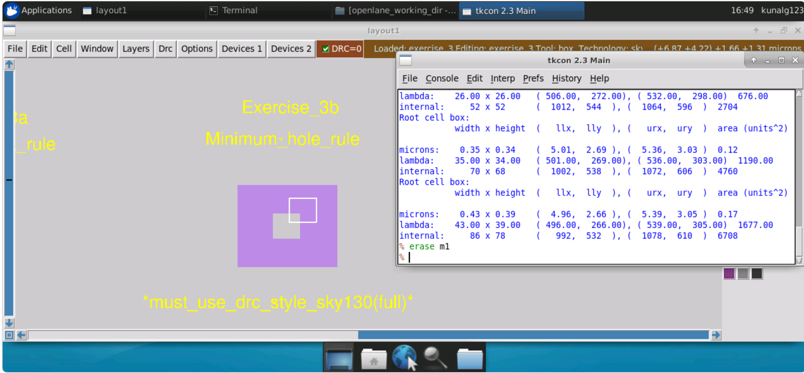

**Figure 50.** Minimum hole rule verification.

</td>

</tr>
</table>

-
## Practical 04 – Well Rules
### Objective

Understand the **well-related design rules** in the SKY130 PDK, focusing on **well structures** and **deep N-well implementation**. These rules ensure proper device isolation, substrate biasing, and reliable fabrication of CMOS layouts.

#### Commands Used

```tcl
drc check
drc why
drc find
```

<table align="center">
<tr>

<td align="center" width="50%">

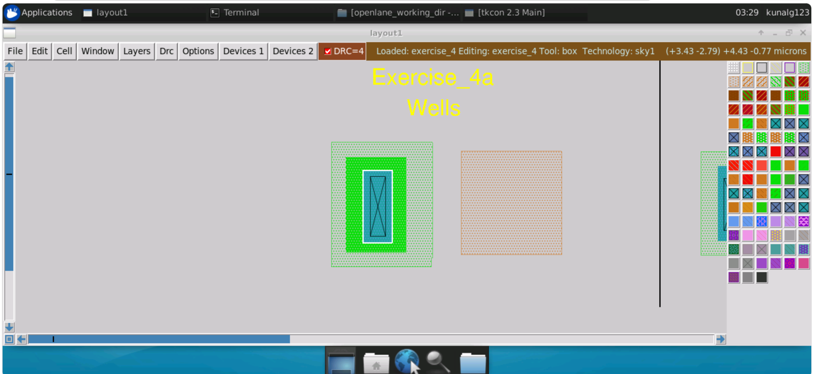

**Figure 51.** Well rule verification.

</td>

<td align="center" width="50%">

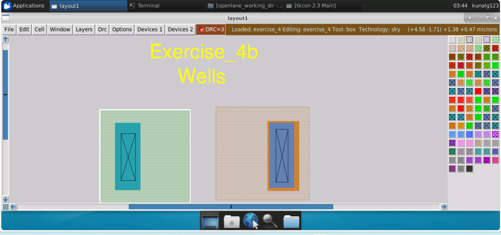

**Figure 52.** Deep N-well rule verification.

</td>

</tr>
</table>

---

## Practical 05 – Derived Layers

### Objective

Understand the concept of **derived layers** in the SKY130 PDK and their role in physical verification. This practical demonstrates standard derived layers, high-voltage derived layers, and the automatic generation of derived layers used internally by the DRC engine.

#### Commands Used

```tcl
drc check
drc why
drc find
```

<table align="center">
<tr>

<td align="center" width="50%">

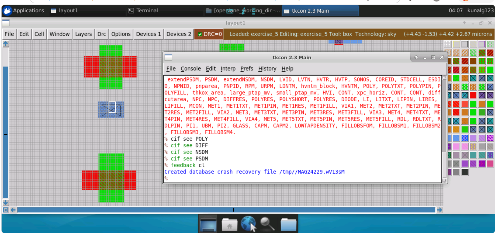

**Figure 53.** Standard derived layer verification.

</td>

<td align="center" width="50%">

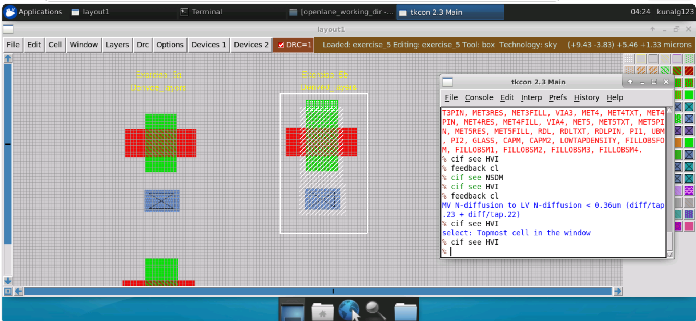

**Figure 54.** High-voltage derived layer verification.

</td>

</tr>
</table>

<br>

<table align="center">
<tr>

<td align="center" width="50%">

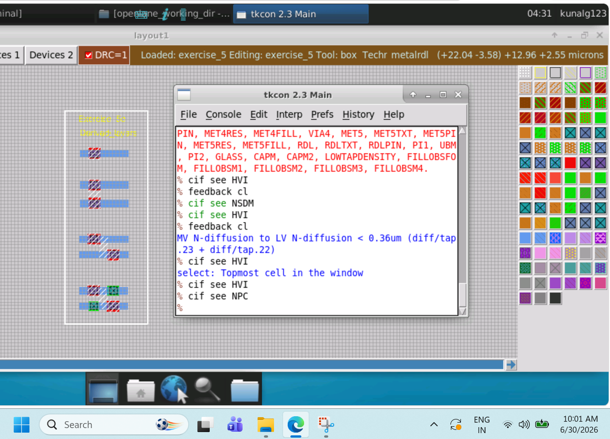

**Figure 55.** Automatic generation of derived layers during DRC verification.

</td>

<td align="center" width="50%">

</td>

</tr>
</table>
  
  ---

## Practical 06 – Parameterized Devices (PCell)

### Objective

Understand the implementation of **Parameterized Devices (PCell)** in the SKY130 PDK. This practical demonstrates how parameterized cells are generated, configured, and verified to ensure that device geometries satisfy the required physical design rules.

#### Commands Used

```tcl
drc check
drc why
drc find
```

<table align="center">
<tr>

<td align="center" width="50%">

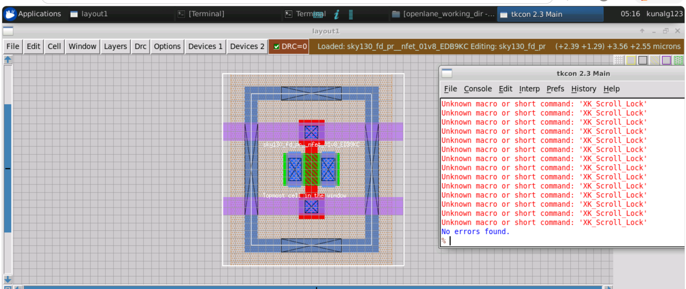

**Figure 56.** Parameterized device implementation.

</td>

<td align="center" width="50%">

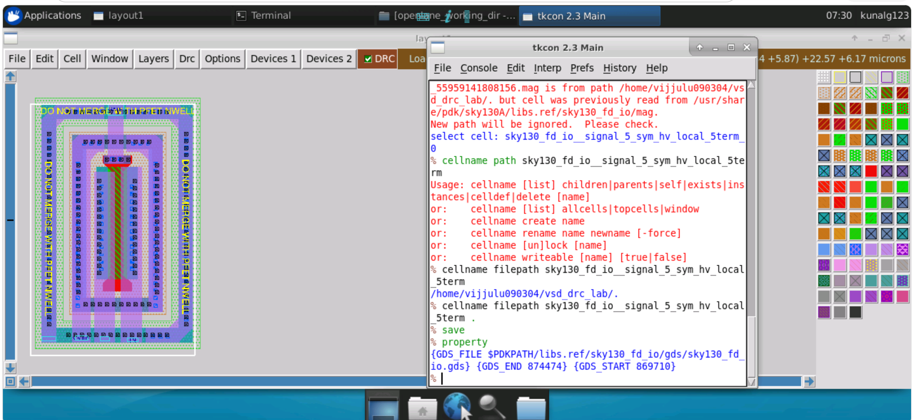

**Figure 57.** Parameterized device configuration and verification.

</td>

</tr>
</table>

<br>

<p align="center">
    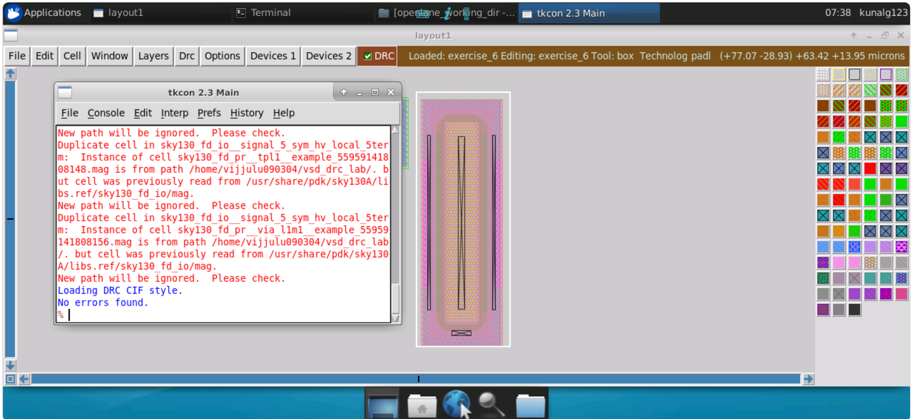
</p>

<p align="center">
    <em><b>Figure 58.</b> Final parameterized device layout satisfying SKY130 design rules.</em>
</p>

---

## Practical 07 – Angle Rules

### Objective

Understand the **angle-related design rules** in the SKY130 PDK. This practical demonstrates how Magic detects non-manufacturable geometries caused by improper angles and verifies layouts against the permitted angular constraints to ensure reliable fabrication.

#### Commands Used

```tcl
drc check
drc why
drc find
```

<table align="center">
<tr>

<td align="center" width="50%">

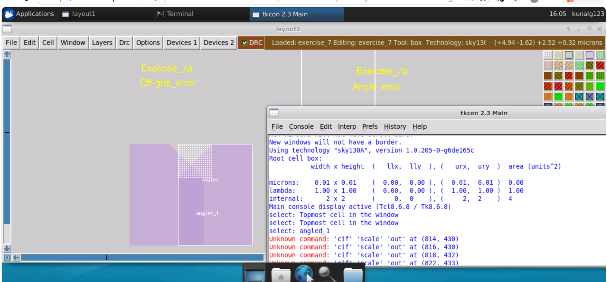

**Figure 59.** Angle rule violation identified during DRC verification.

</td>

<td align="center" width="50%">

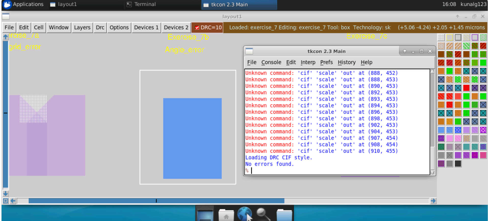

**Figure 60.** Analysis of the angle rule violation using Magic.

</td>

</tr>
</table>

<br>

<p align="center">
    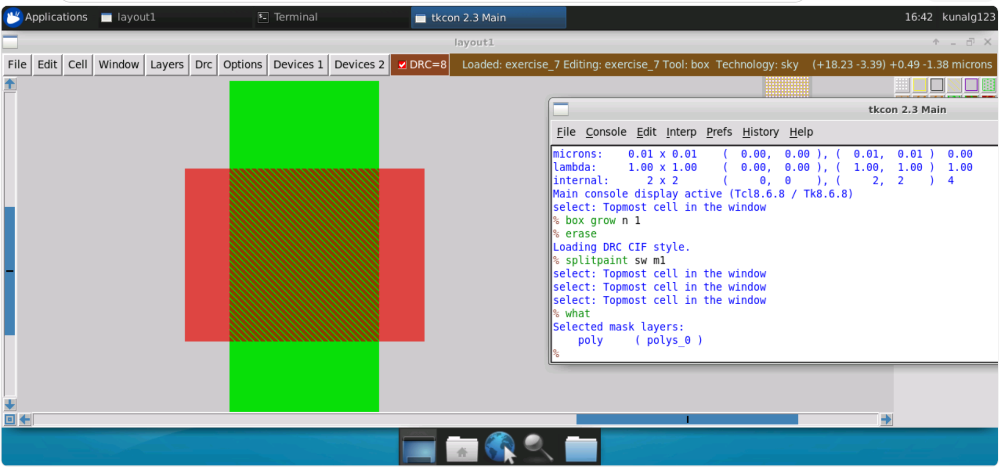
</p>

<p align="center">
    <em><b>Figure 61.</b> Corrected layout satisfying the SKY130 angle rule.</em>
</p>

---

## Practical 08 – Seal Ring Verification

### Objective

Understand the purpose of the **seal ring** in the SKY130 PDK and verify the associated design rules using Magic. Seal rings are placed around the chip boundary to protect the die from mechanical damage, contamination, moisture, and process-induced stress during fabrication and packaging.

#### Commands Used

```tcl
drc check
drc why
drc find
```

<table align="center">
<tr>

<td align="center" width="50%">

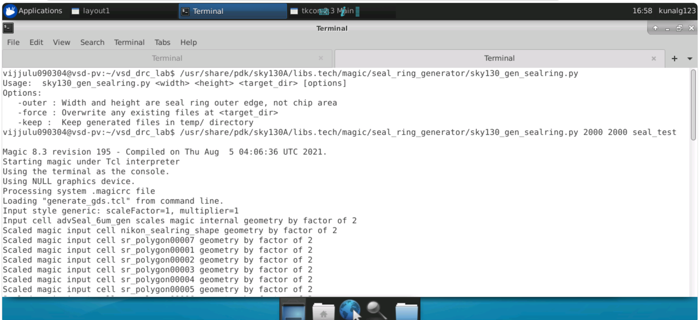

**Figure 62.** Initial seal ring layout and DRC verification.

</td>

<td align="center" width="50%">

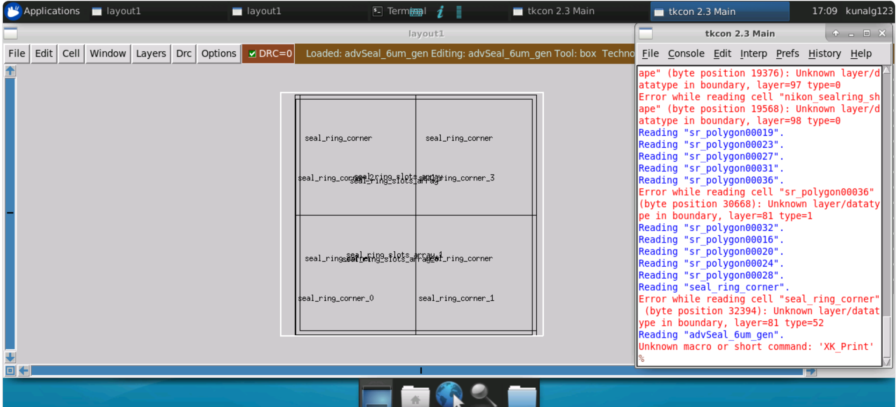

**Figure 63.** Analysis of seal ring rule violations.

</td>

</tr>
</table>

<br>

<p align="center">
    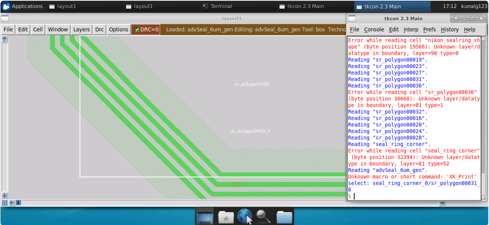
</p>

<p align="center">
    <em><b>Figure 64.</b> Final seal ring layout satisfying the required SKY130 design rules.</em>
</p>


---

## Practical 09 – Latch-Up Rules

### Objective

Understand the **latch-up prevention rules** in the SKY130 PDK and verify the required spacing and well isolation constraints using Magic DRC. These rules help prevent parasitic PNPN structures that can create unintended current paths and lead to device failure.

#### Commands Used

```tcl
drc check
drc why
drc find
```

<p align="center">
    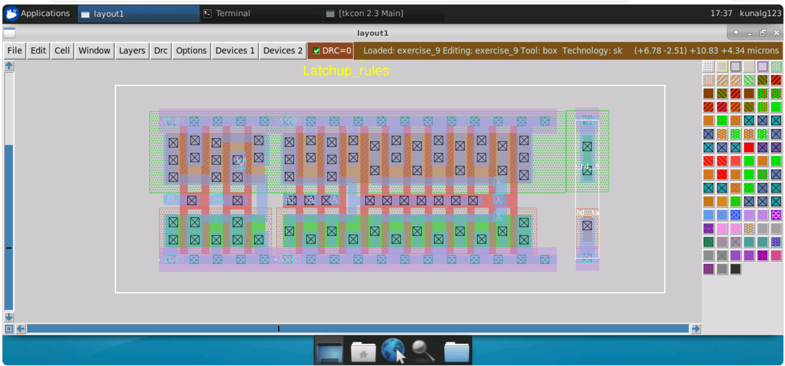
</p>

<p align="center">
    <em><b>Figure 65.</b> Latch-up rule verification using Magic DRC.</em>
</p>

## Practical 10 – Antenna Rules

### Objective

Understand the **antenna effect** in VLSI layouts and verify the corresponding **antenna rules** using Magic DRC. This practical demonstrates how antenna violations occur during fabrication, how they are identified, and the techniques used to eliminate them for reliable chip manufacturing.

#### Commands Used

```tcl
antennacheck
antennacheck debug
drc check
drc why
```

<table align="center">
<tr>

<td align="center" width="50%">

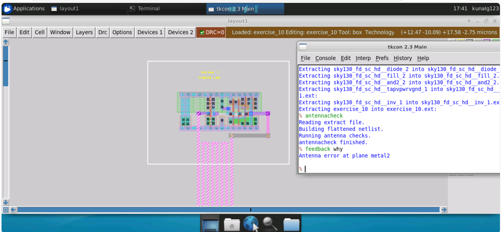

**Figure 66.** Antenna rule verification using Magic DRC.

</td>

<td align="center" width="50%">

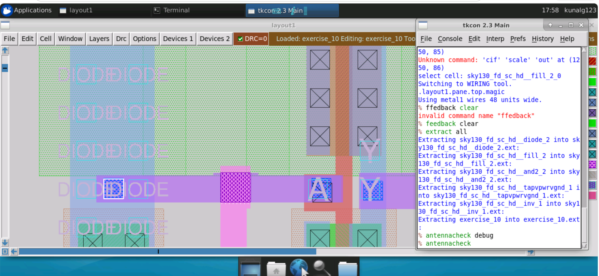

**Figure 67.** Analysis of antenna rule violations.

</td>

</tr>
</table>

<br>

<p align="center">
    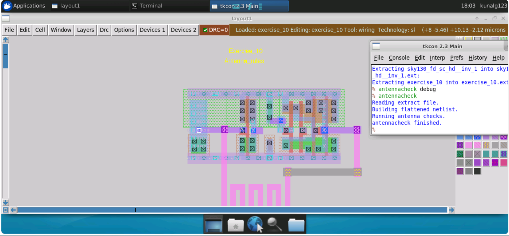
</p>

<p align="center">
    <em><b>Figure 68.</b> Corrected layout satisfying the SKY130 antenna rules.</em>
</p>


---

## Practical 11 – Density Rules

### Objective

Understand the **density verification** process in the SKY130 PDK and learn how metal fill patterns are generated to satisfy the minimum and maximum density requirements before tapeout. This practical demonstrates density analysis, automatic fill generation, and verification using Magic.

#### SKY130 Utility Scripts
/usr/share/pdk/sky130A/libs.tech/magic/check_density.py exercise_11.gds

/usr/share/pdk/sky130A/libs.tech/magic/generate_fill.py exercise_11.mag

#### Magic Commands
cif cover MET2

load exercise_11
box values 0 0 0 0
getcell exercise_11_fill_pattern child 0 0


<table align="center">
<tr>

<td align="center" width="50%">

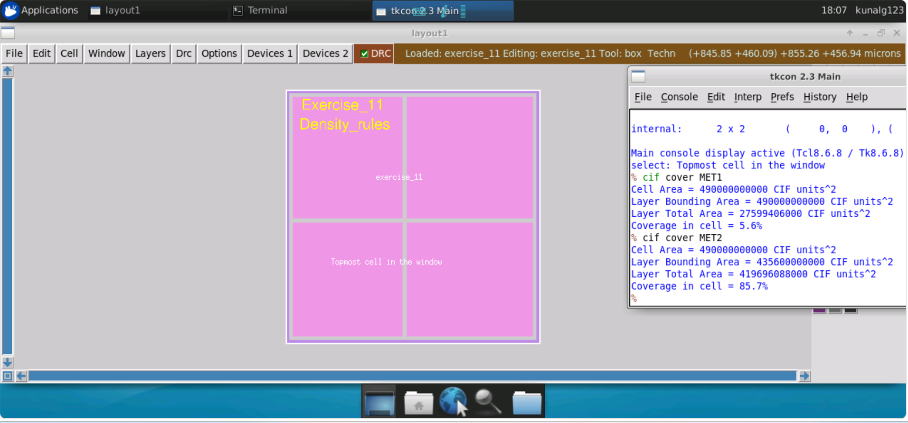

**Figure 69.** Checking metal density using the `cif cover MET2` command.

</td>

<td align="center" width="50%">

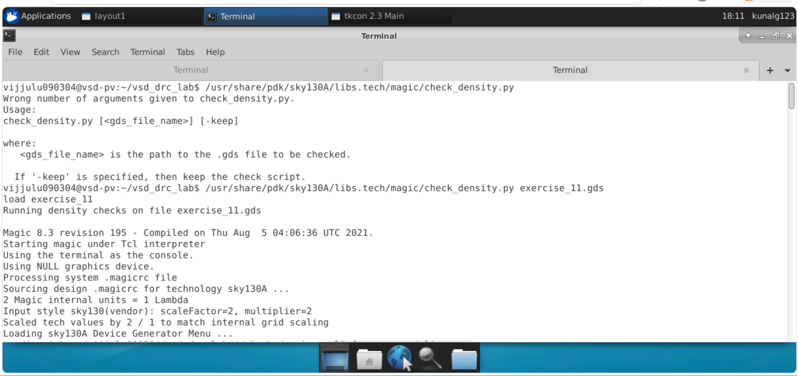

**Figure 70.** Running the SKY130 density checking script.

</td>

</tr>
</table>

<br>

<table align="center">
<tr>

<td align="center" width="50%">

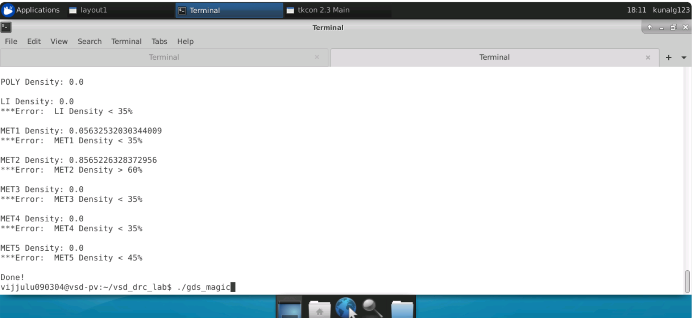

**Figure 71.** Automatic generation of metal fill patterns.

</td>

<td align="center" width="50%">

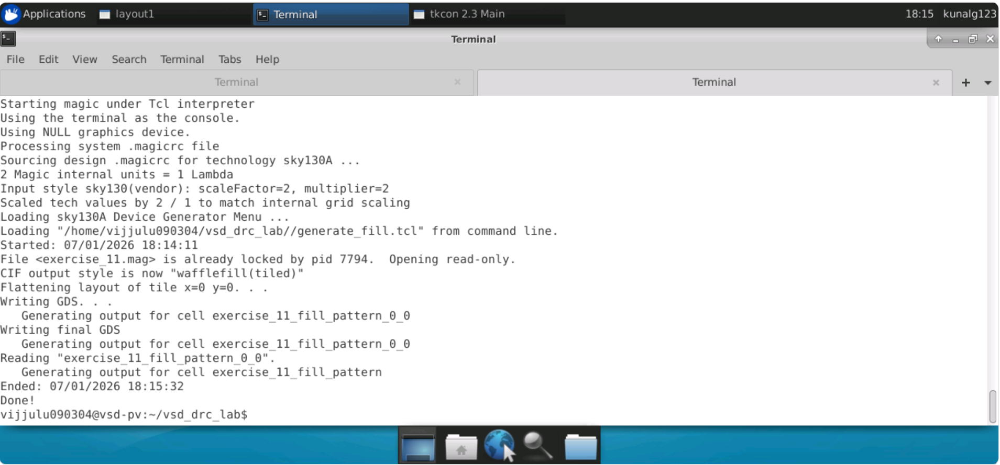

**Figure 72.** Loading the generated fill pattern into the layout.

</td>

</tr>
</table>

<br>

<p align="center">
    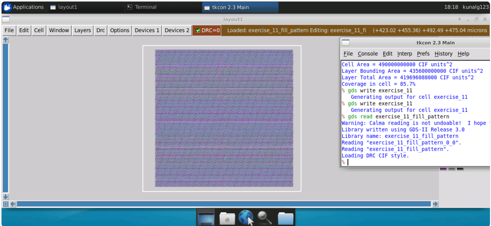
</p>

<p align="center">
    <em><b>Figure 73.</b> Final layout after inserting the generated fill pattern.</em>
</p>

**Learn More**

The complete density verification methodology and related design rules are available in the official SKY130 documentation:

https://skywater-pdk.readthedocs.io/en/main/rules.html

## Common Issues & Solutions

The following are some common issues encountered during the workshop along with the solutions that worked during implementation.

### Issue 1 – Primitive Cells Not Found During LVS

<p align="center">
    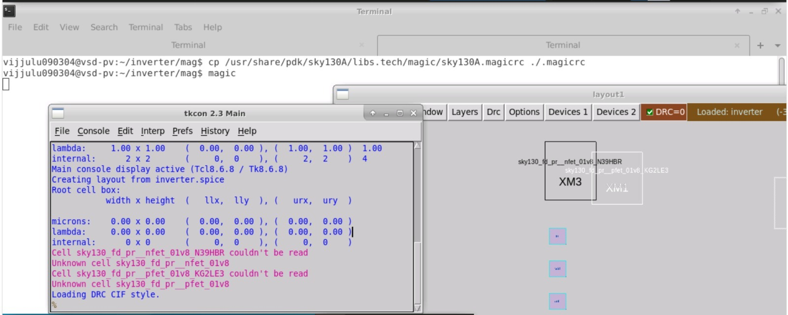
</p>

<p align="center">
    <em>Figure 74. LVS error caused by incorrect SKY130 Open_PDK integration.</em>
</p>

**Problem**

While importing the SPICE netlist or running LVS, Magic/Netgen reports errors such as:

- Unknown cell `sky130_fd_pr_nfet_01v8`
- Unknown cell `sky130_fd_pr_pfet_01v8`
- Unable to read primitive cells

**Cause**

The SKY130 Open_PDK technology files were not linked correctly in the working directory.

**Solution**

- Create a fresh working directory for the lab.
- Copy the required SKY130 technology files into the new directory.
- Verify that the paths match your installation (they may differ depending on the environment).
- Import the SPICE netlist again before running LVS.

For example:

```bash
cp /usr/share/pdk/sky130A/libs.tech/magic/sky130A.magicrc ./.magicrc
```

> **Note:** Depending on the installation, the PDK may be located under `/usr/share/pdk/...` or `/usr/local/share/pdk/...`. Always verify the correct path before executing the commands.

---

### Issue 2 – Unexpected Paint Behavior in Magic

<p align="center">
    
</p>

<p align="center">
    <em>Figure 75. Unexpected painting behavior while editing layouts in Magic.</em>
</p>

**Problem**

After cloning the Lab 3 repository and opening Magic, the layout entered paint mode unexpectedly, making normal editing difficult.

**Solution**

Simply:

1. Zoom out (`Shift + Z`)
2. Zoom back in (`Z`)

The layout window returns to normal operation without restarting Magic.

> This issue may occur occasionally while working in the VNC environment and can usually be resolved by refreshing the view through zooming.
<p align="right">
    <a href="#repository-navigation">Back to Navigation ↑</a>
</p>

# Module 04 – Layout Versus Schematic (LVS)

LVS (Layout Versus Schematic) is the final electrical verification stage that confirms whether the extracted layout netlist is electrically equivalent to the original schematic. It verifies device connectivity, net mapping, pin assignments, and hierarchy to ensure the physical implementation accurately represents the intended circuit before tapeout.

This module focuses on understanding the complete **LVS debugging workflow**, identifying common mismatch scenarios, analyzing Netgen reports, and systematically resolving layout or schematic inconsistencies to achieve a clean LVS result.

<p align="center">
    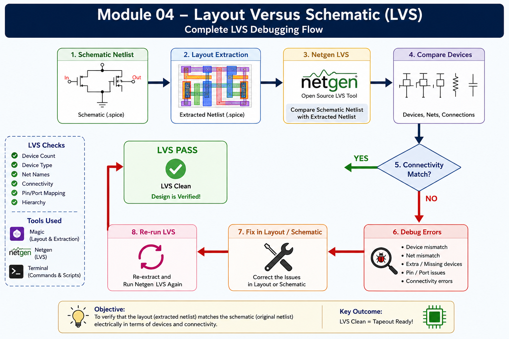
</p>

<p align="center">
    <em><b>Figure 76.</b> Complete Layout Versus Schematic (LVS) debugging workflow using Magic and Netgen.</em>
</p>

---
## Practical 01 – Netgen LVS Fundamentals

### Objective

Understand how **Netgen** compares two SPICE netlists, identifies electrical mismatches, and reports connectivity differences during LVS verification.

---

### Commands Used

```bash
git clone https://github.com/RTimothyEdwards/vsd_lvs_lab.git

cd vsd_lvs_lab

cd exercise_1

ls -al

cat netA.spice

cat netB.spice

diff netA.spice netB.spice

netgen
```

Inside Netgen:

```tcl
lvs netA.spice netB.spice
```

---

### Practical Implementation

<table align="center">
<tr>

<td align="center" width="50%">

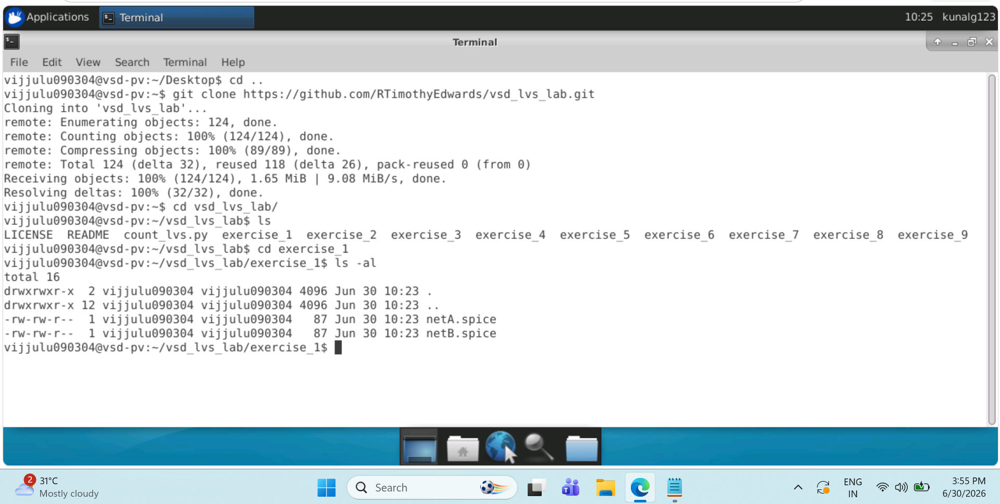

**Figure 75.** Cloning the VSD LVS laboratory and navigating to Exercise 01.

</td>

<td align="center" width="50%">

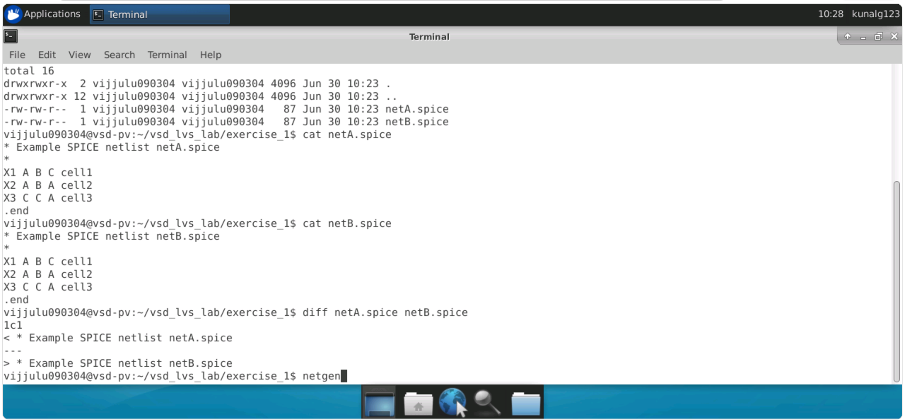

**Figure 76.** Inspecting both SPICE netlists before performing LVS.

</td>

</tr>
</table>

<br>

<table align="center">
<tr>

<td align="center" width="50%">

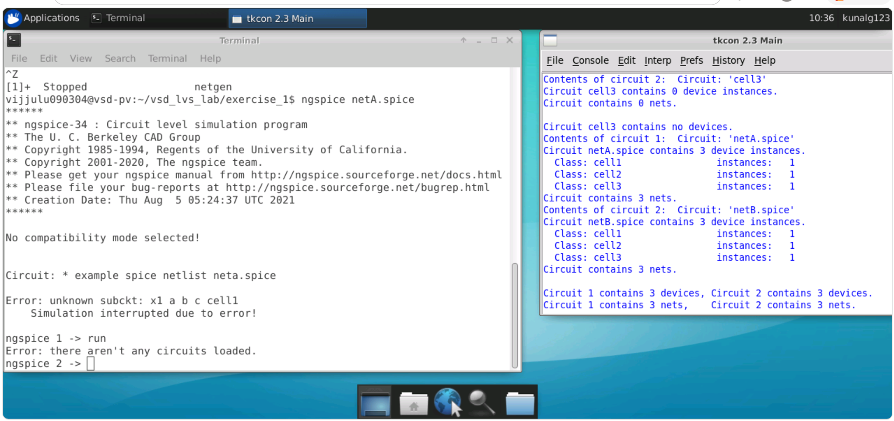

**Figure 77.** ngspice reports an **unknown subcircuit** error, while Netgen can still perform structural netlist comparison.

</td>

<td align="center" width="50%">

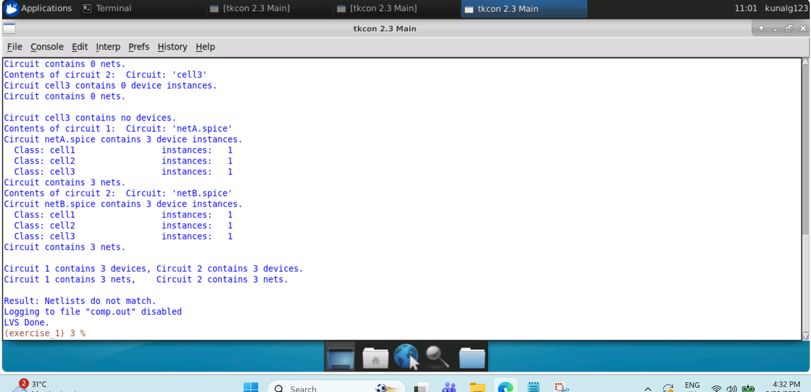

**Figure 78.** Modifying one netlist to intentionally create an LVS mismatch.

</td>

</tr>
</table>

<br>

<table align="center">
<tr>

<td align="center" width="50%">

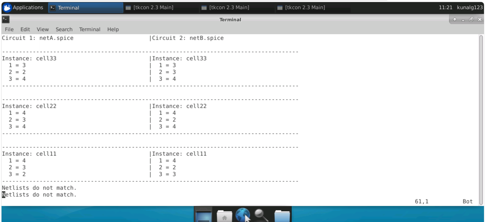

**Figure 79.** Netgen reports that the compared netlists do not match.

</td>

<td align="center" width="50%">

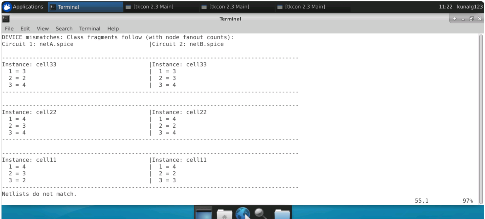

**Figure 80.** Device fanout comparison highlighting the connectivity mismatch.

</td>

</tr>
</table>

---

### Key Points

- Netgen compares **electrical connectivity**, not net names.
- Equivalent nets are automatically grouped during LVS comparison.
- Device mismatches are reported using **pin fanout** information.
- Debugging usually starts from the **net mismatch** section before analyzing device mismatches.

---
## Practical 02 – LVS Comparison Using Subcircuits

### Objective

Understand how Netgen handles subcircuit definitions, compare LVS at the subcircuit level, and verify the effect of pin ordering during netlist comparison.

---

### Commands Used

```bash
netgen

lvs netA.spice netB.spice

reinitialize

lvs "netA.spice test" "netB.spice test"
```

---

### Practical Implementation

<table align="center">
<tr>
<td align="center" width="50%">

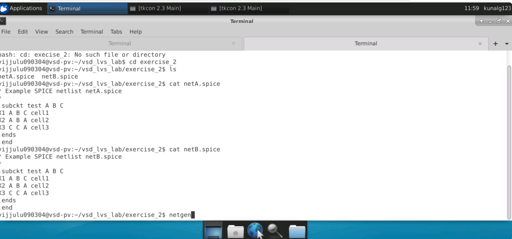

**Figure 81.** Netlists containing the **test** subcircuit.

</td>

<td align="center" width="50%">

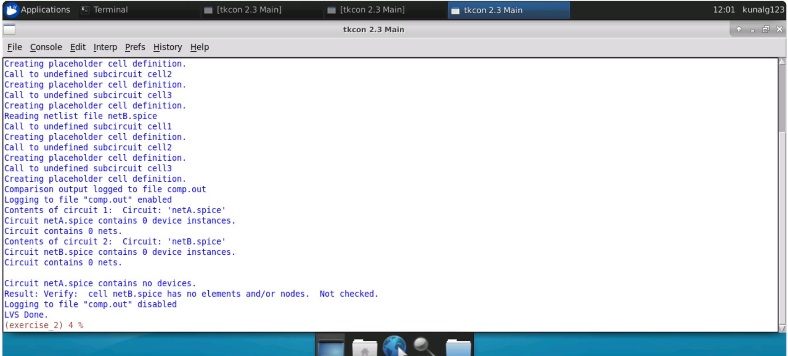

**Figure 82.** Initial LVS comparison without selecting the subcircuit.

</td>
</tr>
</table>

The first LVS comparison treats the netlists as empty because the `.subckt` definition only declares the circuit structure. Since there are no instantiated subcircuits, Netgen reports no active devices or nets.

---

<table align="center">
<tr>
<td align="center" width="50%">

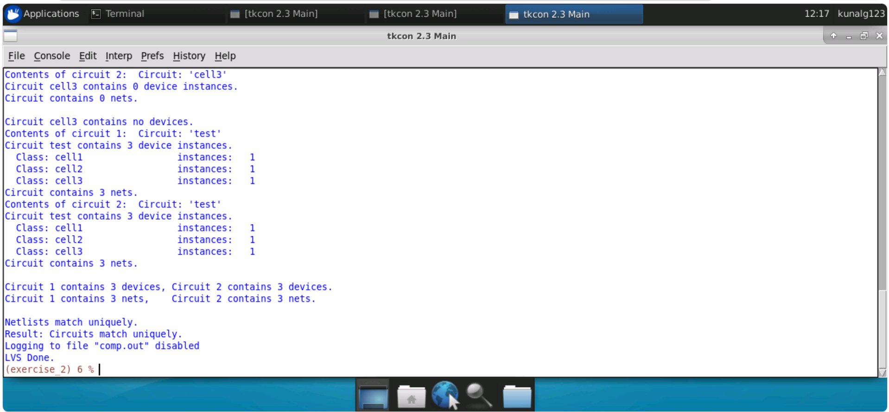

**Figure 83.** LVS executed by explicitly selecting the **test** subcircuit.

</td>

<td align="center" width="50%">

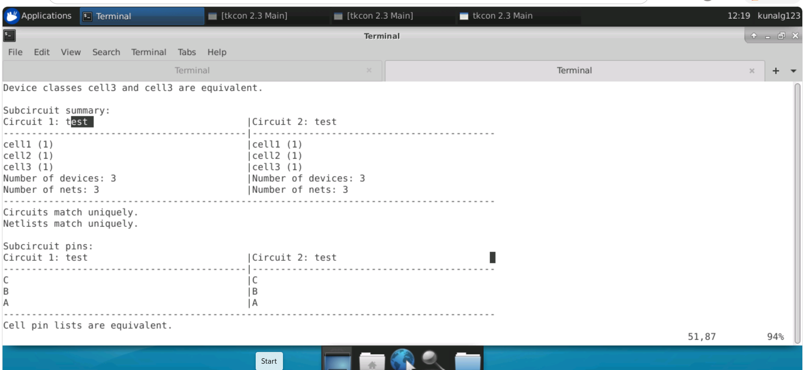

**Figure 84.** Successful LVS comparison showing unique circuit matching.

</td>
</tr>
</table>

Providing the subcircuit name enables Netgen to compare the actual circuit implementation instead of only the definitions.

---

<table align="center">
<tr>
<td align="center" width="50%">

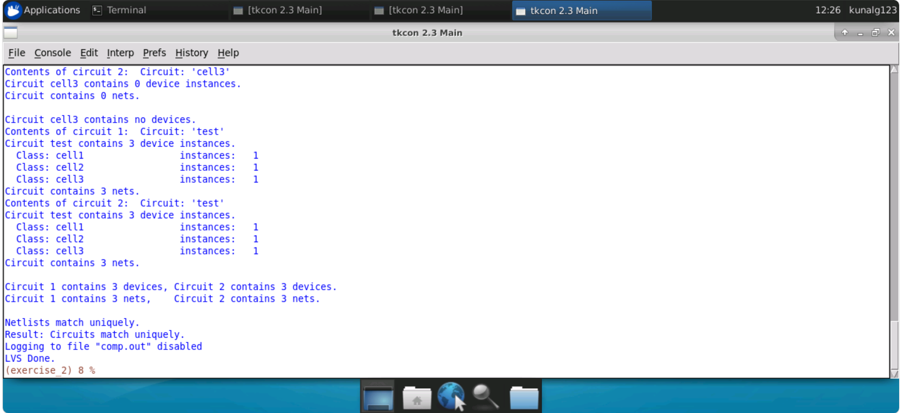

**Figure 85.** LVS after changing only the port order.

</td>

<td align="center" width="50%">

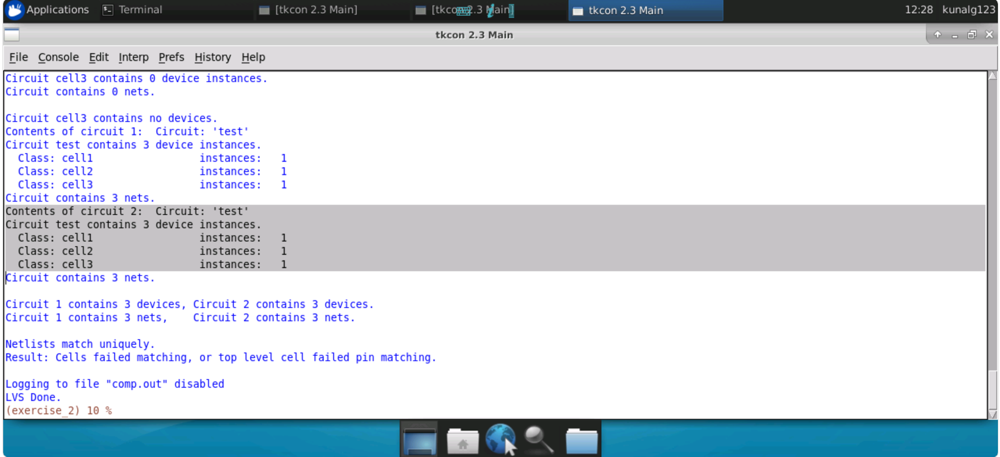

**Figure 86.** LVS reporting top-level pin mismatch.

</td>
</tr>
</table>

Changing only the order of the port names does not affect LVS because Netgen matches ports using their names. However, changing the actual top-level pin mapping results in a mismatch.

---

<p align="center">
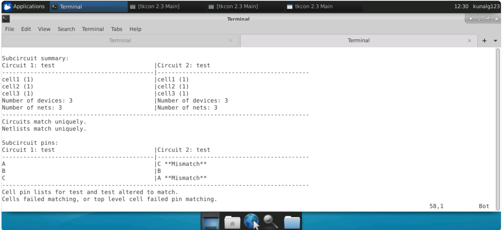
</p>

<p align="center">
<b>Figure 87.</b> Detailed report highlighting the top-level pin mismatch.
</p>

---

### Key Points

- `.subckt` defines a circuit but is not treated as an active device.
- Use `reinitialize` before performing another LVS comparison.
- Comparing at the subcircuit level provides accurate LVS results.
- Netgen matches ports by **pin name**, not by their order.
- Top-level pin names must match for LVS to pass successfully.

# Exercise 03 – Batch Mode LVS & Blackbox Cell Handling
## Objective

Learn how to execute LVS in Netgen using **batch mode**, generate machine-readable JSON reports, understand **blackbox cell behavior**, and analyze the impact of pin and cell modifications during LVS verification.

---

## Commands Used

```bash
netgen -batch lvs "netA.spice test" "netB.spice test" \
/usr/local/share/pdk/sky130A/libs.tech/netgen/sky130A_setup.tcl \
exercise_3_comp.out -json | tee lvs.log

../count_lvs.py | tee -a lvs.log

netgen -batch lvs "netA.spice test" "netB.spice test" \
/usr/local/share/pdk/sky130A/libs.tech/netgen/sky130A_setup.tcl \
exercise_3_comp.out -json -blackbox | tee lvs.log
```

---

## Practical Implementation

Initially, LVS is executed in **batch mode**, generating both a standard comparison report and a JSON output suitable for automated processing. Empty subcircuits are treated as **blackbox cells**, allowing Netgen to compare only their interfaces.

<p align="center">
  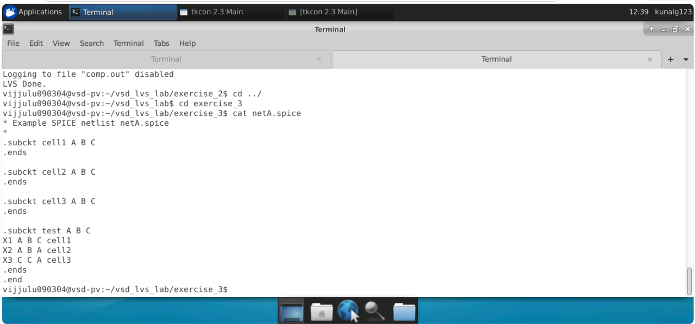
  &nbsp;
  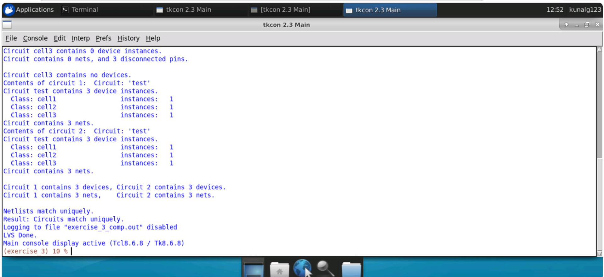
</p>

<p align="center">
<b>Figure 1.</b> Batch-mode LVS setup and successful comparison of blackbox subcircuits.
</p>

---

Next, the pin order of **cell1** is modified to observe how Netgen interprets interface changes. Although the circuit structure remains the same, changing the blackbox interface results in pin mapping differences during LVS.

<p align="center">
  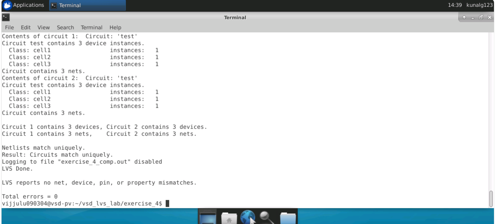
  &nbsp;
  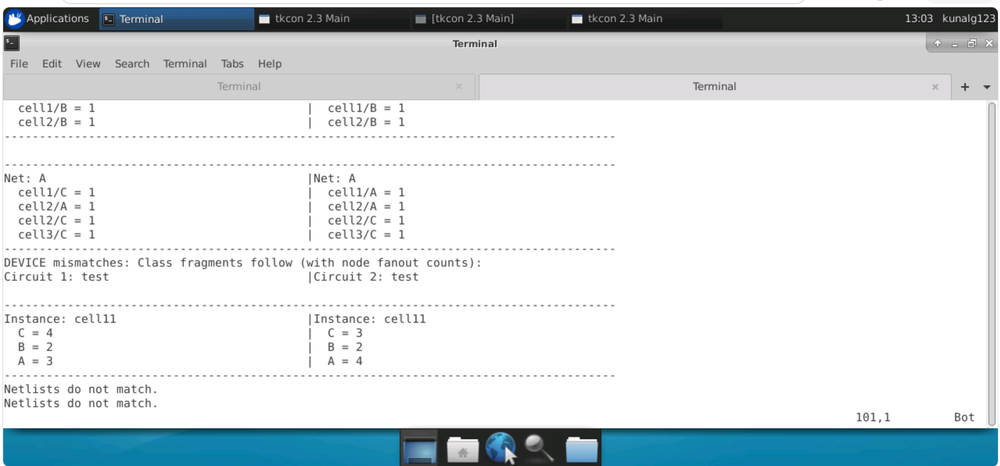
</p>

<p align="center">
<b>Figure 2.</b> Pin order modification resulting in LVS mismatch analysis.
</p>

---

The port name is then changed from **C** to **D**, causing Netgen to create **proxy pins** for the missing connection. This demonstrates how missing ports are represented when comparing blackbox cells.

<p align="center">
  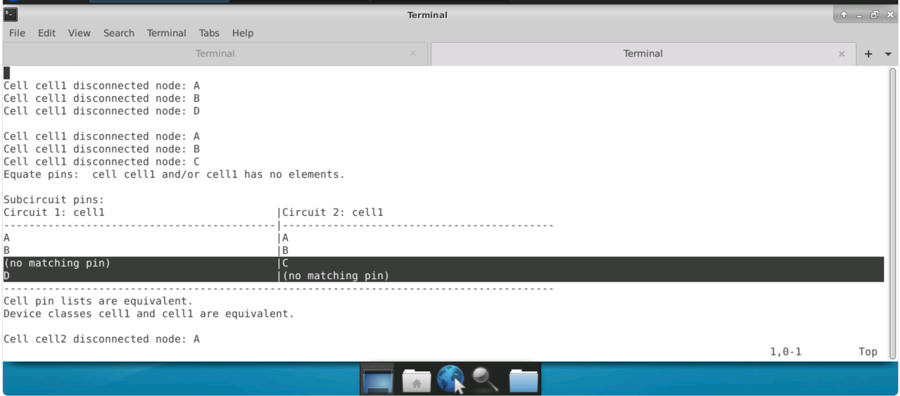
  &nbsp;
  
</p>

<p align="center">
<b>Figure 3.</b> Proxy pin generation after modifying the blackbox interface.
</p>

---

Finally, additional modifications are introduced to evaluate how Netgen handles empty cells during flattening and why the **`-blackbox`** option is required to preserve blackbox behavior during LVS.

<p align="center">
  
</p>

<p align="center">
<b>Figure 4.</b> Final verification demonstrating blackbox-aware LVS behavior.
</p>

---

## Key Takeaways

- Executed LVS in **batch mode** with JSON report generation.
- Used **`count_lvs.py`** for machine-readable LVS analysis.
- Understood how Netgen treats **empty subcircuits as blackbox cells**.
- Verified the effect of **pin order and pin name modifications** on LVS.
- Observed **proxy pin generation** when blackbox interfaces differ.
- Learned the importance of the **`-blackbox`** option for correct LVS verification of empty cells.

# Exercise 04 – Device Pin Permutation in LVS

## Objective

Learn how Netgen handles **low-level device pin permutation**, configure custom permutation rules in the technology setup file, and verify equivalent circuits containing resistors and diodes during LVS.

---

## Commands Used

```bash
cp /usr/local/share/pdk/sky130A/libs.tech/netgen/sky130A_setup.tcl .

netgen -batch lvs "netA.spice test" "netB.spice test" \
sky130A_setup.tcl \
exercise_4_comp.out -json | tee lvs.log
```

### Added to `sky130A_setup.tcl`

```tcl
permute "-circuit1 cell1" A C
permute "-circuit2 cell1" A C
```

---

## Practical Implementation

Initially, low-level devices such as **resistors** are introduced into the subcircuits. Since these are primitive devices (not subcircuits), Netgen compares their connectivity directly. After copying the technology setup file locally, custom **pin permutation** rules are added for the resistor cell to allow equivalent pin swapping during LVS.

<p align="center">
  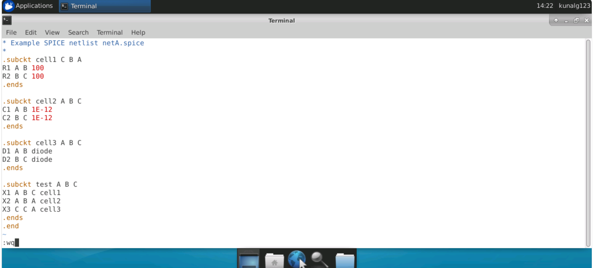
  &nbsp;
  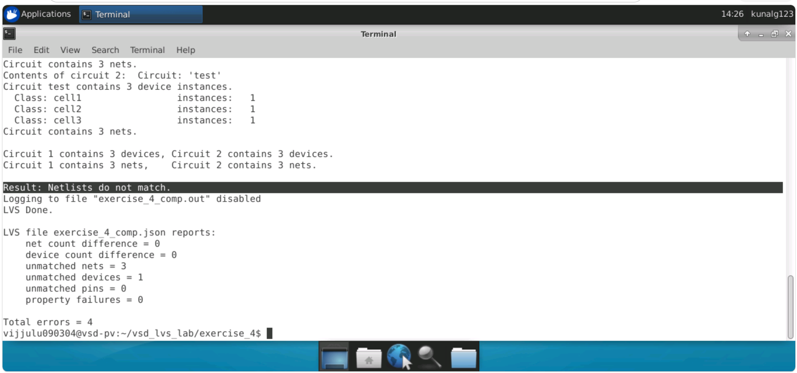
</p>

<p align="center">
<b>Figure 1.</b> Applying resistor pin permutation rules and verifying a successful LVS match.
</p>

---

Next, the **diode** subcircuit is modified by swapping ports at both the subcircuit interface and the primitive device level. Although the circuit remains electrically equivalent, the comparison report highlights the updated pin correspondence while still reporting a successful match.

<p align="center">
  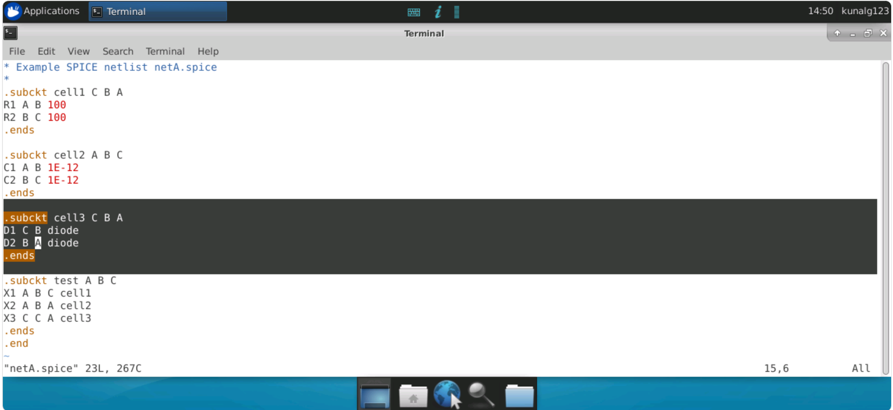
  &nbsp;
  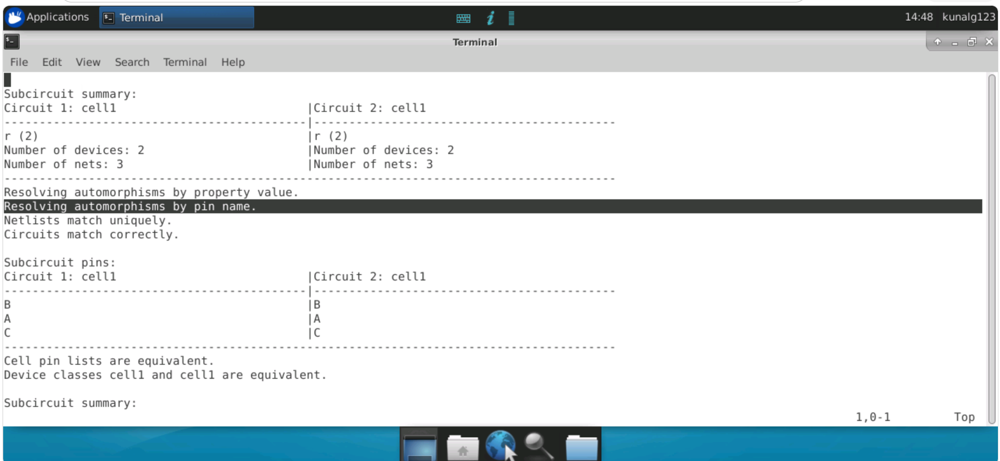
</p>

<p align="center">
<b>Figure 2.</b> Diode pin permutation verification and LVS comparison results.
</p>

---

## Key Takeaways

- Verified LVS using **primitive devices** instead of empty subcircuits.
- Configured **custom pin permutation** rules in `sky130A_setup.tcl`.
- Confirmed that **resistor terminals** can be treated as interchangeable during LVS.
- Verified successful LVS after **diode port swapping**.
- Observed that `comp.out` preserves the updated pin mapping while confirming circuit equivalence.

# Exercise_05 – Layout vs Schematic LVS Verification Using Magic, Xschem and Netgen

## Objective

The objective of this exercise is to perform Layout Versus Schematic (LVS) verification on an analog wrapper using **Magic**, **Xschem**, and **Netgen**. The exercise demonstrates how to:

- Generate schematic and layout netlists.
- Compare both netlists using Netgen.
- Understand hierarchy flattening during LVS.
- Analyze pin mismatch errors.
- Identify layout connectivity issues.
- Correct both layout and schematic.
- Achieve a clean LVS with zero errors.

---

# Step 1: Environment Setup

Before extracting the netlists, copy the required configuration files into the working directory.

```bash
cp /usr/share/pdk/sky130A/libs.tech/xschem/xschemrc .
cp /usr/share/pdk/sky130A/libs.tech/ngspice/spinit .spiceinit
cp /usr/share/pdk/sky130A/libs.tech/magic/sky130A.magicrc .magicrc
```

### Notes

- Copy the **xschemrc** file.
- Copy the **.spiceinit** file.
- Copy the **.magicrc** file.
- These configuration files ensure that Magic and Xschem correctly load the SKY130 PDK libraries.

### Screenshots

| Description | Screenshot |
|------------|------------|
| Copying the required configuration files | 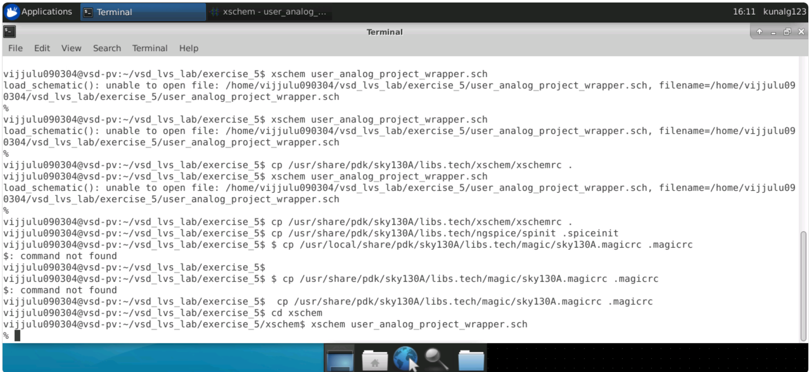 |
| Launching the project environment | 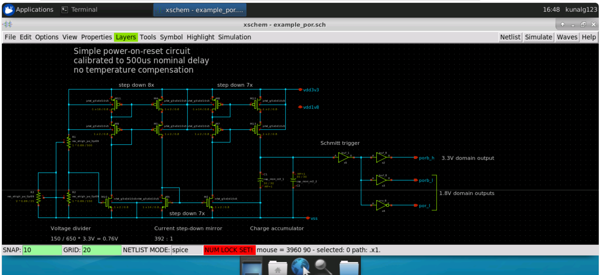 |

---

# Step 2: Generate the Schematic Netlist

Open the analog wrapper schematic inside **Xschem** and generate the SPICE netlist.

### Important Settings

Before exporting the netlist ensure that:

- The extraction directory is correctly configured.
- **Simulation Top Level is Subckt** is enabled.
- Export the complete **testbench netlist** instead of only the subcircuit.

These settings ensure that Netgen receives the complete schematic hierarchy required for LVS.

### Screenshots

| Description | Screenshot |
|------------|------------|
| Analog Wrapper Schematic | 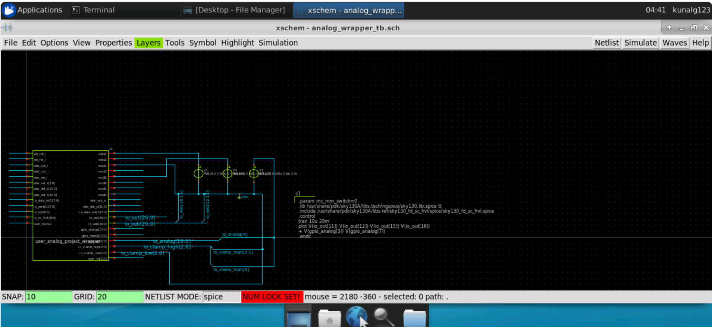 |
| Wrapper Pin Connections | 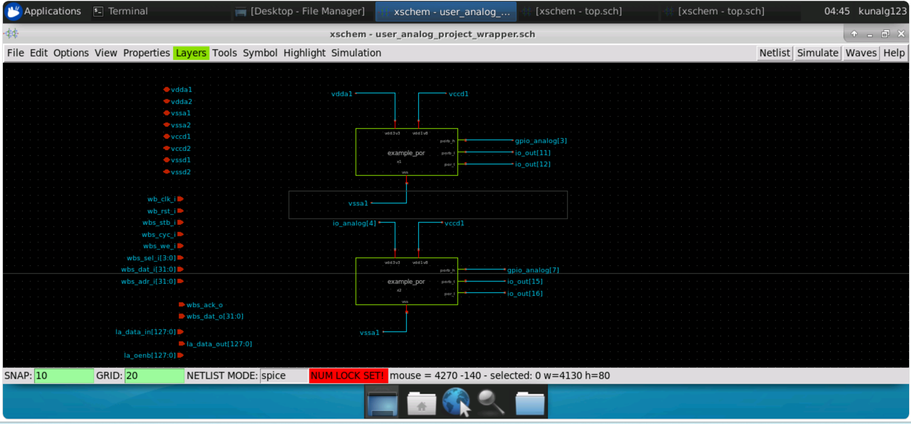 |

---

# Step 3: Extract the Layout Netlist

Open the layout in **Magic**.

```bash
magic -d XR
```

Generate the extracted SPICE netlist using:

```tcl
ext2spice lvs
```

Magic extracts the physical layout and produces the SPICE netlist for LVS comparison.

### Screenshot

| Description | Screenshot |
|------------|------------|
| Layout Netlist Extraction | 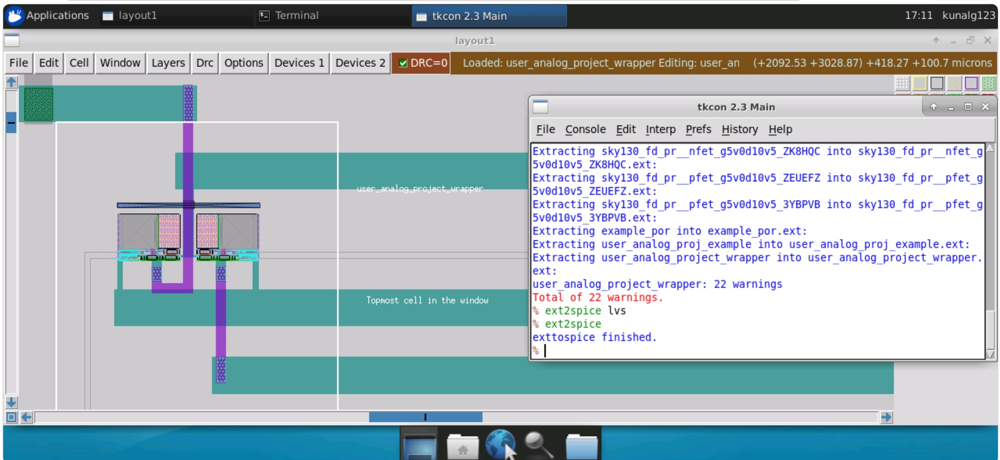 |

---

# Step 4: Perform Initial LVS Comparison

Run Netgen to compare the schematic and layout netlists.

The first LVS comparison reports several mismatches.

### Initial Observations

- Device counts match.
- Net counts match.
- Several unmatched nets are reported.
- Pin mismatches are identified.

This indicates that the schematic and layout are structurally similar but still contain connectivity issues.

### Screenshots

| Description | Screenshot |
|------------|------------|
| Initial LVS Report | 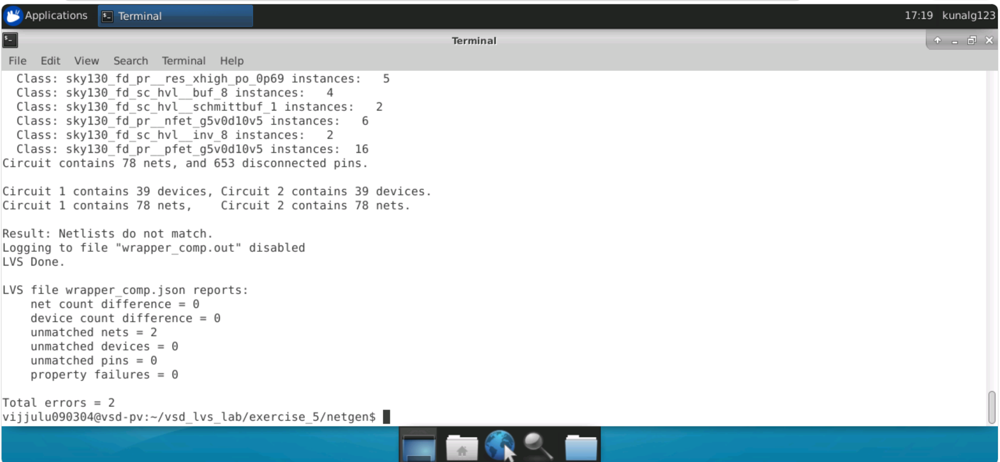 |
| Running LVS on the Analog Wrapper | 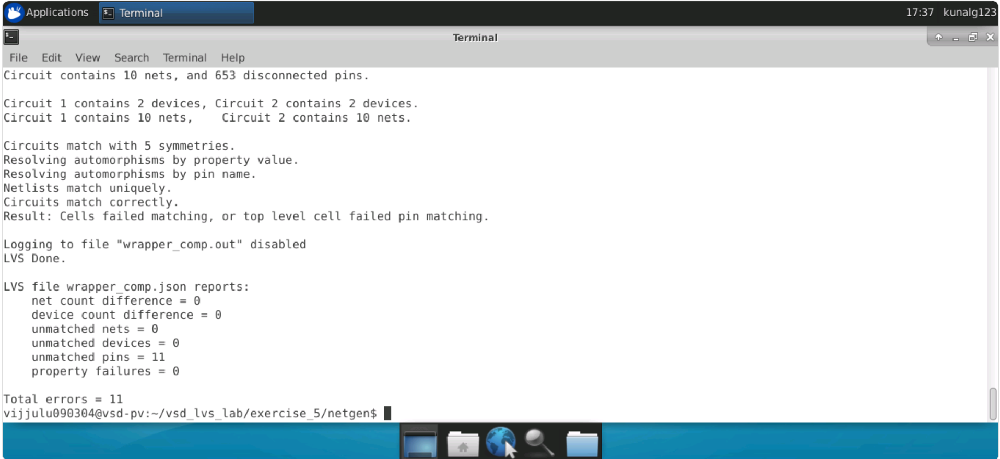 |

---

# Step 5: Understanding the LVS Mismatch

The comparison shows that several standard-cell definitions are absent in the extracted schematic hierarchy.

Since Netgen cannot find their complete definitions, it automatically treats them as **black-box cells**.

Instead of performing full device matching, Netgen reports pin-level mismatches for these cells.

This behavior simplifies debugging while preserving the circuit hierarchy.

### Screenshots

| Description | Screenshot |
|------------|------------|
| Wrapper Mismatch Summary | 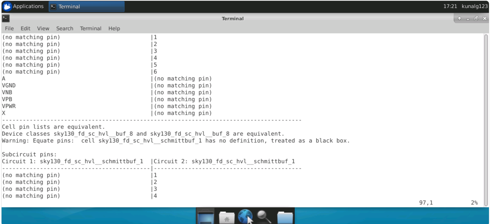 |
| Pin Mapping Mismatch |  |

---

# Step 6: Comparing the example_por Cell

Instead of debugging the complete wrapper immediately, the **example_por** block is verified separately.

During comparison, Netgen recognizes that the layout and schematic use different hierarchy levels.

### Layout Hierarchy

```
Top-Level Circuit
        │
Parameterized Devices
        │
Primitive Devices
```

### Schematic Hierarchy

```
Top-Level Circuit
        │
Primitive Devices
```

Although the hierarchy differs, Netgen automatically **flattens** both netlists before comparison.

As a result, the extracted devices match successfully.

### Screenshots

| Description | Screenshot |
|------------|------------|
| LVS Result for example_por | 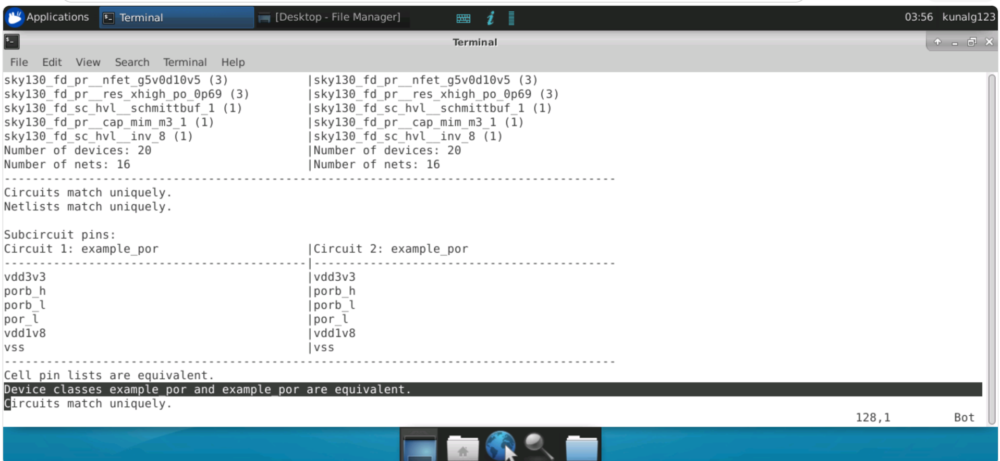 |
| Automatic Device Flattening | 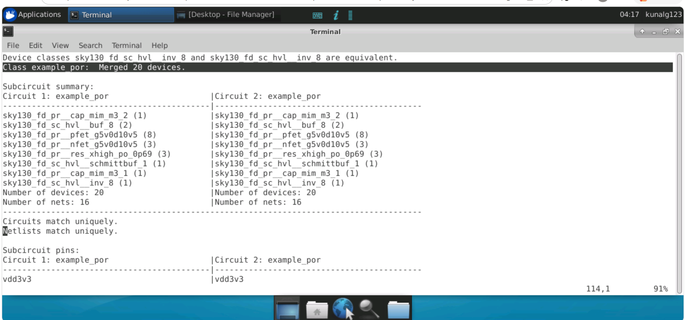 |

---

# Step 7: Investigating the Wrapper Pin Mismatch

After verifying **example_por**, LVS is repeated for the complete wrapper.

The comparison identifies an incorrect connection involving:

- **io_analog[4]**
- **io_clamp_high[0]**

The **comp.out** report clearly highlights the mismatched pins, helping locate the physical connectivity issue inside the layout.

### Screenshot

| Description | Screenshot |
|------------|------------|
| Wrapper Pin Information |  |

---

# Step 8: Correcting the Layout

The extracted **.mag** layout is inspected to locate the shorted nets.

The investigation confirms that:

- **io_analog[4]**
- **io_clamp_high[0]**

are unintentionally shorted.

To resolve the issue, a **Metal3 resistor (resmet3)** is inserted between the two nets.

The layout netlist is then extracted again.

### Screenshot

| Description | Screenshot |
|------------|------------|
| Layout Correction using Metal3 Resistor | 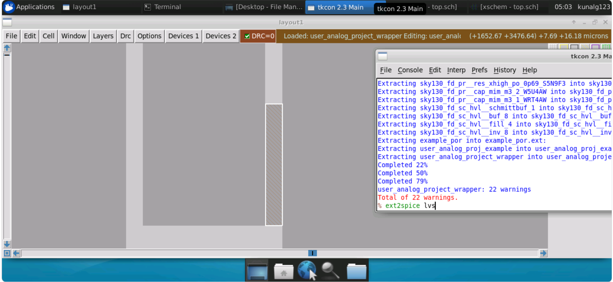 |

---

# Step 9: Updating the Schematic

To keep the schematic synchronized with the corrected layout, the same resistor is added in **Xschem**.

The resistor dimensions are configured to match the physical implementation.

Finally, the complete testbench netlist is exported again.

### Screenshot

| Description | Screenshot |
|------------|------------|
| Updated Analog Wrapper Schematic | 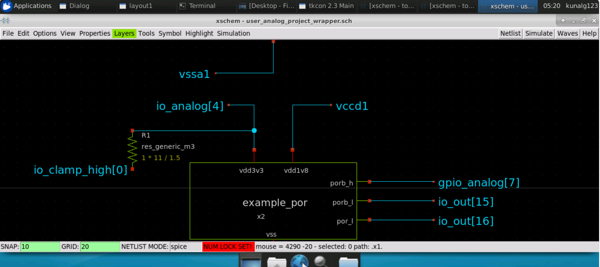 |

---

# Step 10: Final LVS Verification

After updating both the layout and schematic, Netgen is executed once again.

The previous mismatch is completely resolved.

The final LVS confirms:

- Matching device count
- Matching net count
- Matching pin connectivity
- No unmatched nets
- No unmatched devices
- Successful LVS verification

### Screenshot

| Description | Screenshot |
|------------|------------|
| Final LVS Result | 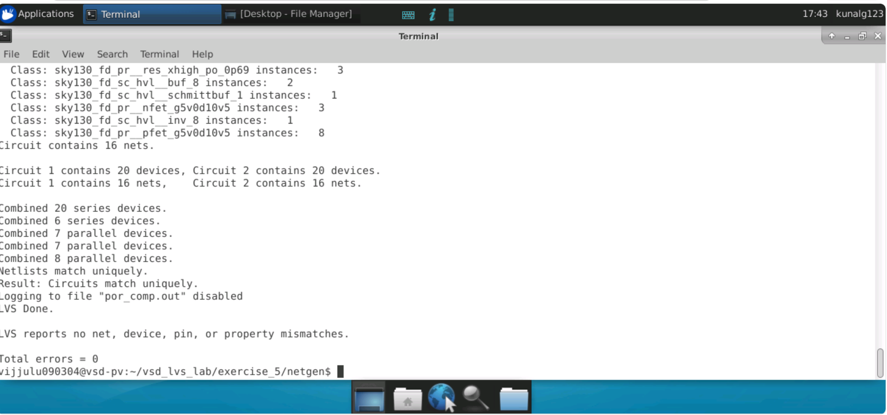 |

---

# Key Observations

- Proper extraction settings are essential before generating schematic netlists.
- Missing standard-cell definitions are interpreted as black-box cells.
- Netgen automatically flattens hierarchical circuits before comparison.
- Parameterized devices are decomposed into primitive devices during LVS.
- The **comp.out** report is useful for locating pin mismatches and connectivity errors.
- Layout shorts can be corrected by modifying both the physical layout and the schematic.
- Maintaining consistency between layout and schematic is essential for achieving a successful LVS.

---
# Exercise 06: Resolving LVS Mismatch Due to Fill Cells in Digital PLL

## Objective

This exercise demonstrates how fill cells inserted during the digital place-and-route flow can introduce apparent mismatches during Layout Versus Schematic (LVS) verification. Since Magic ignores these fill cells during extraction by default, Netgen reports discrepancies between the layout and schematic netlists. The objective is to understand the cause of these mismatches, configure the extraction environment correctly, and achieve a clean LVS result.

---

## Workflow Overview

```
Digital PLL Layout
        │
        ▼
Layout Extraction using Magic
        │
        ▼
Generate SPICE Netlist
        │
        ▼
Run Netgen LVS
        │
        ▼
Observe Fill Cell Mismatch
        │
        ▼
Enable GDS-Based Extraction
        │
        ▼
Re-run LVS
        │
        ▼
Successful LVS Match
```

---

# Step 1: Inspecting the Digital PLL Layout

The Digital PLL layout generated during the physical design flow contains several standard cells, including filler cells that are automatically inserted by the router. These filler cells improve well continuity and maintain design rule compliance but do not contribute to the circuit functionality.

### Layout of the Digital PLL

<p align="center">
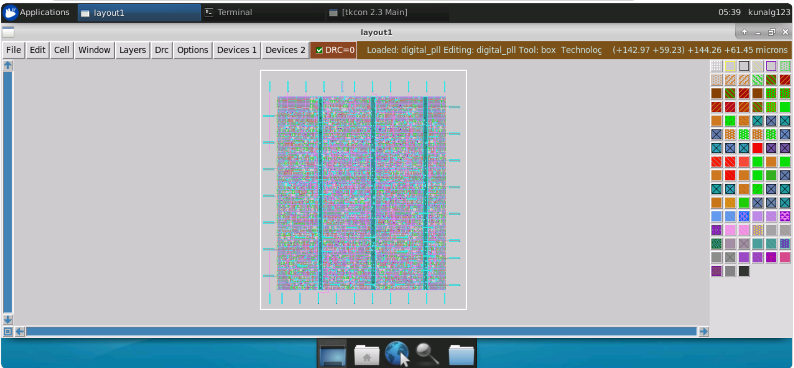
</p>

---

# Step 2: Performing Layout Extraction

The layout is extracted using Magic with the following command:

```tcl
ext2spice lvs
```

Magic generates the SPICE netlist required for LVS comparison.

### Layout Extraction

<p align="center">
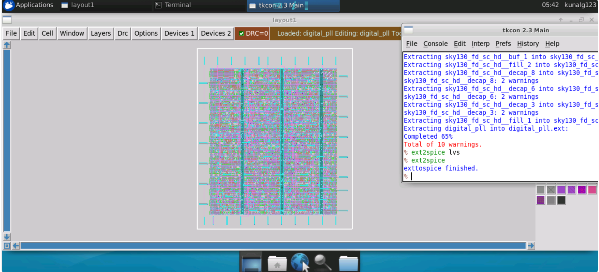
</p>

---

# Step 3: Understanding the Cause of the LVS Error

Initially, LVS reports mismatches even though the functional circuitry is correct.

The mismatch occurs because:

- Magic ignores filler cells during extraction.
- The Verilog netlist still contains these filler cells.
- Netgen therefore compares different numbers of devices.

The comparison output clearly shows the additional filler cells present in the schematic netlist.

### Initial LVS Mismatch

<p align="center">
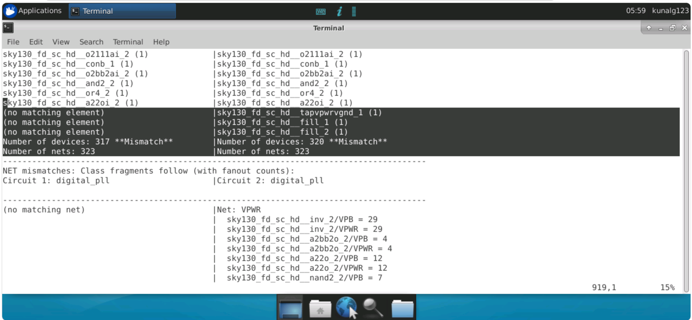
</p>

---

# Step 4: Examining the Fill Cells

The highlighted cells are standard filler cells automatically inserted by the digital implementation tools.

These cells:

- Maintain well continuity.
- Improve manufacturing robustness.
- Do not affect circuit functionality.
- Are intentionally ignored by Magic during normal extraction.

### Example Fill Cell

<p align="center">
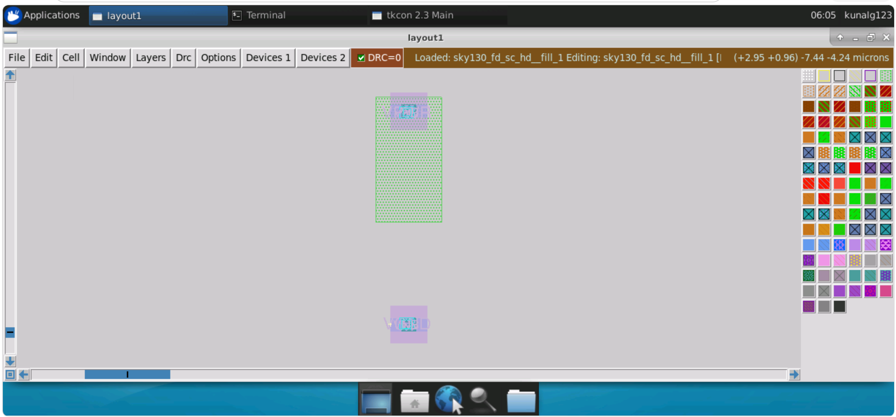
</p>

---

# Step 5: Identifying the Root Cause

Magic reports warnings indicating that filler cell terminals are not fully extracted because they contain no functional circuitry.

This confirms that the mismatch originates from the extraction process rather than from the circuit itself.

### Extraction Warnings

<p align="center">
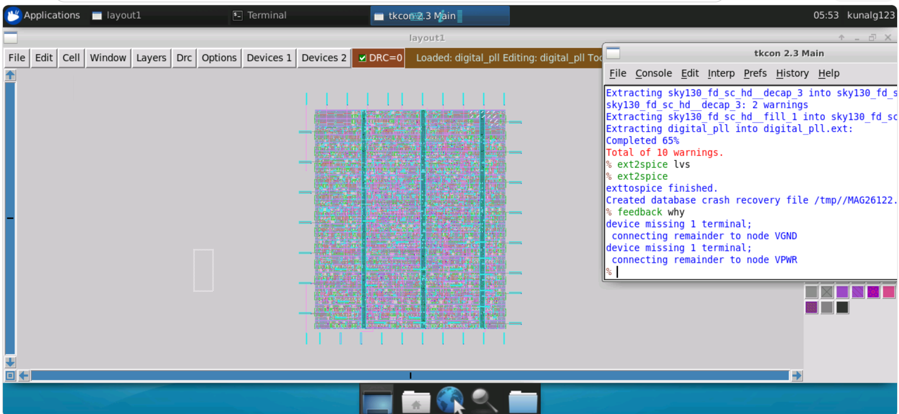
</p>

---

# Step 6: Reviewing the Generated Netlist

The generated Verilog netlist includes all standard cells, including filler and decap cells.

Since these cells are present in the schematic but absent in the extracted layout netlist, Netgen reports mismatches.

### Digital PLL Netlist

<p align="center">
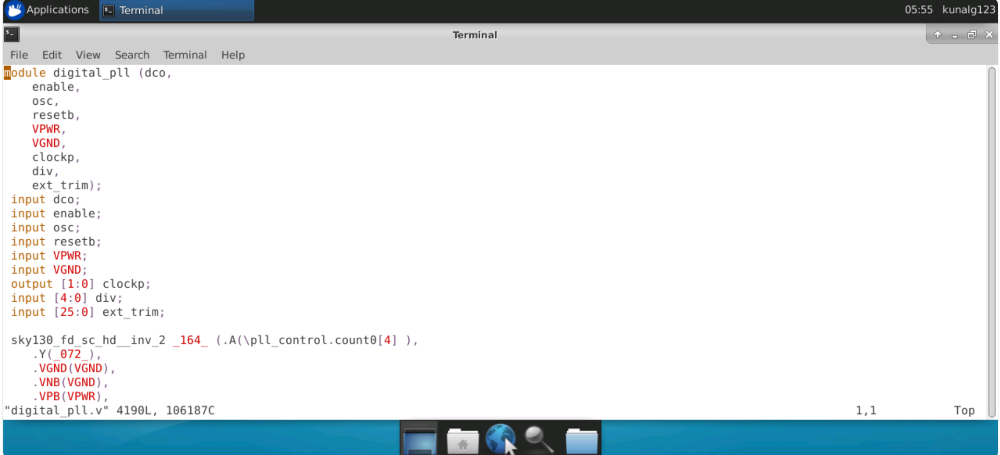
</p>

---

# Step 7: Updating the LVS Environment

To instruct Magic to use the GDS database during extraction, the environment variable below is added to the `run_lvs` script:

```bash
export MAGIC_EXT_USE_GDS=1
```

This forces Magic to retain the required digital fill cell information during extraction.

### Environment Configuration

<p align="center">
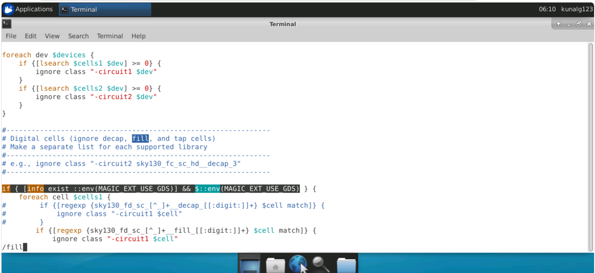
</p>

---

# Step 8: Modifying the LVS Run Script

The `run_lvs` script is updated by inserting the environment variable before executing Netgen.

```bash
export MAGIC_EXT_USE_GDS=1

netgen -batch lvs \
"../mag/digital_pll.spice digital_pll" \
"../verilog/digital_pll.v digital_pll" \
/usr/share/pdk/sky130A/libs.tech/netgen/sky130A_setup.tcl \
exercise_6_comp.out -json | tee lvs.log
```

### Updated run_lvs Script

<p align="center">
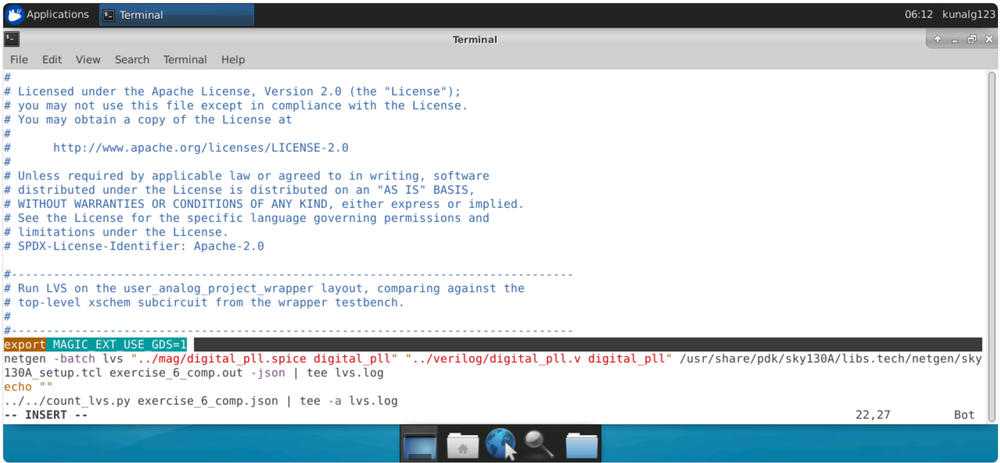
</p>

---

# Step 9: Re-running LVS

After enabling GDS-based extraction, Magic now includes the filler cell information required by Netgen.

The extraction completes successfully without introducing any artificial mismatches.

### Updated Extraction

<p align="center">

</p>

---

# Step 10: Final LVS Verification

The LVS comparison now reports:

- Equal device count
- Equal net count
- No unmatched devices
- No unmatched nets
- No pin mismatches
- Total Errors = **0**

This confirms that the extracted layout and schematic are electrically equivalent.

### Successful LVS Result

<p align="center">
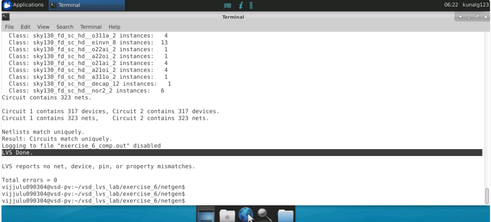
</p>

---

# Key Learning Outcomes

- Understood why filler cells create apparent LVS mismatches.
- Learned that Magic ignores non-functional fill cells during standard extraction.
- Identified the effect of missing filler cells on Netgen comparison.
- Configured Magic to perform GDS-aware extraction.
- Successfully modified the LVS execution script.
- Achieved a clean LVS result with zero mismatches.

---

# Commands Used

```bash
ext2spice lvs

export MAGIC_EXT_USE_GDS=1

netgen -batch lvs \
"../mag/digital_pll.spice digital_pll" \
"../verilog/digital_pll.v digital_pll" \
/usr/share/pdk/sky130A/libs.tech/netgen/sky130A_setup.tcl \
exercise_6_comp.out -json | tee lvs.log
```

---

# Observations

- Fill cells are inserted automatically during digital implementation.
- They are important for fabrication but do not contribute to circuit functionality.
- Magic skips these cells during normal extraction.
- Enabling `MAGIC_EXT_USE_GDS=1` allows Netgen to compare equivalent structures.
- The final LVS verification completes successfully with zero errors.

---

